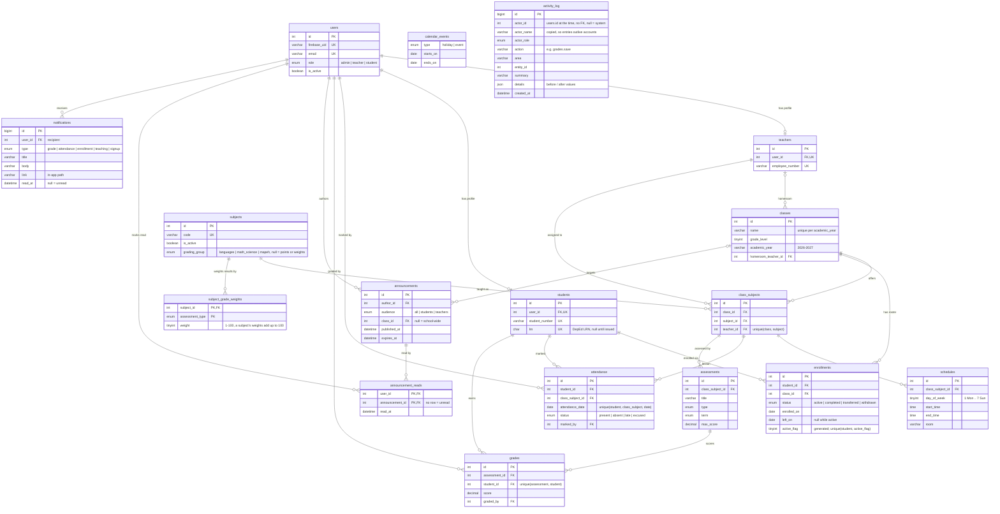

# Architecture

How the School Management System is put together, in the order a request meets it. The reasoning behind each choice is in [PROJECT_PLAN.md](PROJECT_PLAN.md) (decisions D1–D42).

## 1. The big picture

```
Browser (React SPA)
   │  1. sign in with e-mail + password ──────────────▶ Firebase Authentication (identity only)
   │  ◀── ID token (JWT, 1 hour) ───────────────────────┘
   │
   │  2. every API call: Authorization: Bearer <ID token>
   ▼
Express API  (/api/v1)
   │  verifies the token with the Firebase Admin SDK
   │  loads the user's row from MySQL (role, is_active)
   ▼
MySQL 8  ── users, profiles, classes, attendance, grades, …  (all data and all authorization)
```

**Firebase proves who you are. MySQL decides what you may do.** The role is stored only in MySQL, never in a Firebase custom claim, so changing or revoking access takes effect on the very next request and there is no second place that can disagree.

## 2. Identity and authorization

| Concern | Where it lives |
|---|---|
| Password, e-mail ownership, token signing | Firebase Authentication |
| Role (`admin`, `teacher`, `student`), `is_active` | `users` table (role is immutable) |
| "May this teacher edit this class?" | `access` module, the single policy file for ownership and visibility |

Per request, `authenticate` does: verify the ID token → find the `users` row by `firebase_uid` → reject unknown users (`USER_NOT_REGISTERED`) and inactive users (`ACCOUNT_DISABLED`) → attach `{ id, role, studentId, teacherId, activeClassId }` to the request. Role gates (`authorize('admin', 'teacher')`) sit next to each route; row-level rules (a teacher only grades their own class-subjects, a student only reads their own records) are in `modules/access`.

Accounts have exactly one creation path, `createUserAccount`: it creates (or, for trusted callers, adopts) the Firebase user, writes the `users` + profile rows in one transaction, and deletes the Firebase user again if MySQL fails, so the two systems never drift. Public self-registration only ever creates students.

## 3. Backend layers

```
routes ─▶ controller ─▶ service ─▶ repository ─▶ MySQL
  │          │             │            │
  │          │             │            └─ SQL only, parameterised, returns camelCased rows
  │          │             └─ business rules, access checks, response shaping
  │          └─ HTTP in/out only (reads req.validated, calls respond helpers)
  └─ path + method, role gate (authorize), request validation (zod schemas)
```

Every feature module under `backend/src/modules/<name>/` has the same five files (`*.routes.js`, `*.controller.js`, `*.service.js`, `*.repository.js`, `*.schemas.js`), plus a second service file where a module has a separate set of rules:

- `enrollments/promotion.service.js` – the DepEd promotion rules behind self-enrollment: where a student stands for next year (`GET /enrollments/next-class`) and enrolling themselves in an offered section (`POST /enrollments/next-class`), which ends in the same enrollment code the admin uses (`enrollments.service.js`).
- `dashboard/atRisk.service.js` – the "needs attention" list of the admin and teacher dashboards.

The other exceptions only drop a layer they do not need: `auth` has no repository (it uses the users module), `dashboard` has no schemas, `health` is a route and a controller, and `access` is a service and a repository that hold the ownership and scoping rules every other service calls (the `assert*` checks, `classScope`, and `scopeRecordFilters`: one scoping rule for the attendance and grade lists and summaries). A bug is found by following one path: the URL names the route file, the route names the controller, and so on down. Cross-module data goes through the other module's **service**, never its SQL.

Cross-cutting pieces are written once:

- `middleware/` – request id, logging, validation, authentication, authorization, 404, error handler.
- `utils/ApiError.js` + `utils/mysqlErrorMap.js` + `utils/firebaseErrorMap.js` – every failure becomes one of eleven stable error codes.
- `utils/pagination.js` + `utils/sql.js` – one list/search/sort/filter implementation shared by all list endpoints.
- `utils/sheets.js` – the save checks shared by the attendance sheet and the grade sheet: every row must be a student on the roster (400 `not_enrolled`), a row that changed since the teacher loaded it is refused (409 `sheet_changed`), and each saved change goes to the activity log with its value before.
- `utils/grading.js` – the grade arithmetic (section 5).
- `config/migrations.js` + `database/upgrades.js` – versioned schema changes (section 5).
- `constants/shared.js` – enums and limits; a byte-identical copy lives in the frontend and `npm run check:constants` fails if they drift or if a database ENUM disagrees.

## 4. API conventions

- Base path `/api/v1`; interactive documentation at `/api/docs` (OpenAPI 3, `backend/docs/openapi.yaml`).
- Success: `{ "success": true, "data": …, "meta"?: { page, limit, total } }`. Failure: `{ "success": false, "error": { "code", "message", "details"? } }`. Every response carries an `X-Request-Id` header that also appears in the server log.
- Lists accept `page`, `limit` (max 100), `search`, a whitelisted `sortBy`, `sortOrder` and resource filters. `meta.total` is counted with the same filters.
- Scoping rule: omit a filter and you get your own scope; ask for something outside your scope and you get `403`, never a silently narrowed result. `me` is accepted as an id for your own student/teacher/author.
- Error codes: `VALIDATION_ERROR` 400, `UNAUTHORIZED` 401, `FORBIDDEN` 403, `USER_NOT_REGISTERED` 403, `ACCOUNT_DISABLED` 403, `NOT_FOUND` 404, `CONFLICT` 409, `SCHEDULE_CONFLICT` 409, `RATE_LIMITED` 429, `INTERNAL_ERROR` 500, `SERVICE_UNAVAILABLE` 503. The specifics are in `details.reason` or `details.key`.

## 5. Data model

`class_subjects` ("class C is taught subject S by teacher T") is the hub: timetable slots, attendance and assessments all hang off it, which is what makes "teacher assignment" a first-class relationship instead of a column.



`activity_log` has no foreign keys on purpose: it copies the actor's name and role, so an entry outlives the rows it mentions. Besides these 17 tables there is one bookkeeping table outside `schema.sql`, `schema_migrations`, created by `config/migrations.js` (see schema changes below).

Rules the database itself enforces (not just the API):

- One account per e-mail and per Firebase user; a profile row belongs to exactly one user.
- **One active enrollment per student**, via a generated `active_flag` column plus a unique key; closed enrollments stay as history, and every enrollment is its own row (re-joining a class adds a row). Attendance and grade rosters are dated: the students who were in the class on that day.
- One teacher per subject per class; one attendance mark per student per lesson per day; one grade per student per assessment.
- Foreign keys are `RESTRICT` everywhere: history is never silently deleted. An account or a subject with history is retired (`is_active = 0`) instead. One that nothing refers to yet, such as an account created by mistake, can be deleted (`DELETE /users/:id`, `DELETE /subjects/:id`, 409 otherwise); the service first deletes what belongs only to it (an account's profile row, notifications and read marks, a subject's grade weights) in the same transaction.

Rules the service layer enforces because SQL cannot express them: schedule overlaps (class, teacher or room, per academic year, serialised with a named lock), `score <= max_score`, no attendance for future dates, only enrolled students on a sheet or grade batch, a subject's grade weights adding up to 100.

Schema changes: `schema.sql` creates the tables of a new database (`CREATE TABLE IF NOT EXISTS`). A change to an existing table also goes into `database/upgrades.js` under a new id. `config/migrations.js` applies `schema.sql` again when its checksum has changed, then runs each upgrade that `schema_migrations` has not recorded yet, under a named lock so two starting instances cannot both migrate. `npm run db:migrate` runs it by hand; with `MIGRATE_ON_START=true` the API runs it at every start. Upgrades only move forward: undoing one is a new upgrade.

Activity log: services call `activity.record()` after each successful change; the actor is read from the request context that `authenticate` opens (`utils/requestContext.js`), and a failed log write never fails the request.

Results: a subject with a grading group is graded on the DepEd K-12 components (written work, performance tasks, quarterly assessment; the weighted initial grade is transmuted to 60–100, 75 passes); a subject with grade weights per assessment type uses those; any other subject is graded on points (`SUM(score) / SUM(max_score)`). A student's general average is the mean of their subject results. The arithmetic is in `backend/src/utils/grading.js`.

## 6. Roles and what they can do

`Y` = any record, `own` = within the caller's scope, `N` = 403. A teacher's *visible* scope is the class-subjects they teach plus every class-subject of a class they are homeroom teacher of (reads); they *own* only the class-subjects assigned to them (writes).

| Capability | Admin | Teacher | Student |
|---|---|---|---|
| Accounts: create any role, edit, (de)activate, delete an unused one; import students from CSV | Y | N | N |
| Own identity and contact fields (`/auth/me`) | Y | Y | Y |
| Students: list and read | Y | own (visible classes) | own (self) |
| Students: edit profile | Y | N | N |
| Teachers: list | Y | N | N |
| Teachers: read | Y | own (self) | N |
| Teachers: edit | Y | N | N |
| Subjects, classes, school calendar: read | Y | Y | Y |
| Subjects, classes, teacher assignment, enrollments, timetable, school calendar: write | Y | N | N (except self-enrollment, next row) |
| Enroll themselves in next year's class (`/enrollments/next-class`, when the promotion rules allow) | N | N | own (self) |
| Class-subjects, enrollments, timetable: read | Y | own (visible) | own (active class, self) |
| Attendance: mark and correct (through the sheet) | Y | own (owns the lesson) | N |
| Attendance: read records and summary | Y | own (visible) | own (self) |
| Assessments: create, edit, delete; grades: enter, delete | Y | own (owns the lesson) | N |
| Assessments, grades: read | Y | own (visible) | own (active class, own grades) |
| Announcements: create | Y (any audience, optional class) | own (a visible class is required) | N |
| Announcements: edit, delete | Y | own (authored) | N |
| Announcements: read | Y (all statuses) | targeted and authored | targeted, active only |
| Activity history | Y | N | N |
| Notifications: read, mark read | own | own | own |
| Dashboard | admin payload: school-wide counts | teacher payload: today's lessons, pending grading | student payload: schedule, attendance, grades |

Enforcement: the role column is `authorize(...)` on the route; every `own` cell is a named rule in `modules/access/access.service.js` (`assertCanViewClass`, `assertCanViewClassSubject`, `assertCanManageClassSubject`, `assertCanViewStudent`, `assertIsSelfTeacher`, `assertIsAuthor`, and for lists `classScope`, `scopedStudentId`, `assertFiltersInScope` and `scopeRecordFilters`). The UI hides what a role cannot do, but the API is the enforcement point.

## 7. Frontend

A single-page React app with one route tree and three role areas (`/admin`, `/teacher`, `/student`) behind a role guard. Server state lives in TanStack Query (one query-key factory, one API client that attaches the Firebase ID token and unwraps the envelope); forms use react-hook-form with zod schemas that reuse the shared constants; list filters live in the URL so a filtered view can be bookmarked and the back button works. Details: [PROJECT_PLAN.md, section 9](PROJECT_PLAN.md#9-frontend-summary) and [frontend/README.md](../frontend/README.md).

Behaviour that two pages share is written once. The attendance and grade sheets share `hooks/useSheetEditing.js` (the unsaved-changes guard, reading a refused save, reloading the sheet) and `components/ui/SheetAlerts.jsx` (the read-only note and the save alert with its Reload button). `features/classSubjects/access.js` decides who may write to a lesson, the same rule as the API's `assertCanManageClassSubject`, so a page only offers what the API will accept. Every icon comes from one set, lucide-react.

The sign-in page can list demo accounts, folded under the form, from the build variable `VITE_DEMO_ACCOUNTS` (read in `config/env.js`, shown by `features/auth/components/DemoAccounts.jsx`). Without the variable the page lists nothing; the live site gets it from a GitHub repository variable, so no password is in the repository.

## 8. Time and dates

The school time zone (`APP_TIMEZONE`) decides what "today" means, MySQL connections run in UTC, `DATE` values travel as plain `YYYY-MM-DD` strings and times as `HH:MM`. The academic year starts in August (`ACADEMIC_YEAR_START_MONTH` in `constants/shared.js`, read by both sides): 2026-10-03 belongs to `2026-2027`, 2027-05-10 also does. Weekdays are ISO (1 = Monday … 7 = Sunday) everywhere.

## 9. Testing

`npm test` in `backend/` runs the shared-constants check and the API test suite against a separate `school_management_test` database. Firebase is replaced by an in-memory fake, so the suite needs MySQL but no Firebase project and no network. The tests exercise the real Express app through HTTP (supertest) and cover role gates, scoping, validation, conflicts, the all-or-nothing bulk writes, the migrations and the seed script itself.

`npm test` in `frontend/` runs the Vitest unit tests in `frontend/tests` in plain Node, with no browser, database or Firebase project: grade arithmetic, form schemas, CSV import and export, dates and school years. One of them (`grading-agreement.test.js`) runs one table of scores through `backend/src/utils/grading.js` and the frontend's `src/utils/grades.js` and expects the same numbers, so a change to the rounding, the averaging or the passing grade on one side fails until the other side follows.

GitHub Actions runs both suites on every push and pull request: `backend-tests.yml` (lint, secrets check, `npm test` against MySQL 8) and `frontend-checks.yml` (lint, a TypeScript check of the JSDoc types in the `.js` logic files, unit tests, build). `deploy-frontend.yml` releases the frontend from `main` only after the backend tests pass, and runs the frontend lint and tests again before it builds.
