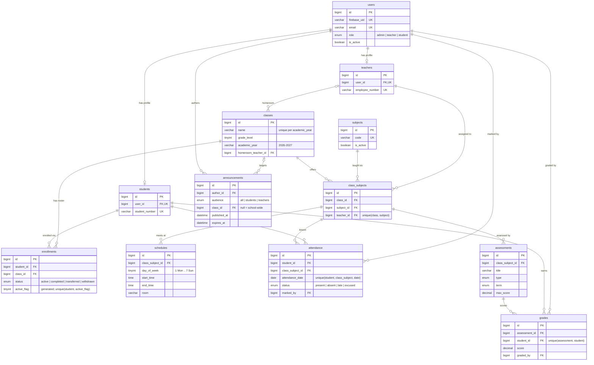

# Architecture

How the School Management System is put together, in the order a request meets it. The reasoning behind each choice is in [PROJECT_PLAN.md](PROJECT_PLAN.md) (decisions D1–D35) and the documents in [design/](design/).

## 1. The big picture

```
Browser (React SPA)
   │  1. sign in with e-mail + password ──────────────▶ Firebase Authentication (identity only)
   │  ◀── ID token (JWT, 1 hour) ───────────────────────┘
   │
   │  2. every API call: Authorization: Bearer <ID token>
   ▼
Express API  (/api/v1)
   │  verifies the token with the Firebase Admin SDK
   │  loads the user's row from MySQL (role, is_active)
   ▼
MySQL 8  ── users, profiles, classes, attendance, grades, …  (all data and all authorization)
```

**Firebase proves who you are. MySQL decides what you may do.** The role is stored only in MySQL, never in a Firebase custom claim, so changing or revoking access takes effect on the very next request and there is no second place that can disagree.

## 2. Identity and authorization

| Concern | Where it lives |
|---|---|
| Password, e-mail ownership, token signing | Firebase Authentication |
| Role (`admin`, `teacher`, `student`), `is_active` | `users` table (role is immutable) |
| "May this teacher edit this class?" | `access` module, the single policy file for ownership and visibility |

Per request, `authenticate` does: verify the ID token → find the `users` row by `firebase_uid` → reject unknown users (`USER_NOT_REGISTERED`) and inactive users (`ACCOUNT_DISABLED`) → attach `{ id, role, studentId, teacherId, activeClassId }` to the request. Role gates (`authorize('admin', 'teacher')`) sit next to each route; row-level rules (a teacher only grades their own class-subjects, a student only reads their own records) are in `modules/access`.

Accounts have exactly one creation path, `createUserAccount`: it creates (or, for trusted callers, adopts) the Firebase user, writes the `users` + profile rows in one transaction, and deletes the Firebase user again if MySQL fails, so the two systems never drift. Public self-registration only ever creates students.

## 3. Backend layers

```
routes ─▶ controller ─▶ service ─▶ repository ─▶ MySQL
  │          │             │            │
  │          │             │            └─ SQL only, parameterised, returns camelCased rows
  │          │             └─ business rules, access checks, response shaping
  │          └─ HTTP in/out only (reads req.validated, calls respond helpers)
  └─ path + method, role gate (authorize), request validation (zod schemas)
```

Every module under `backend/src/modules/<name>/` has the same five files (`*.routes.js`, `*.controller.js`, `*.service.js`, `*.repository.js`, `*.schemas.js`). A bug is found by following one path: the URL names the route file, the route names the controller, and so on down. Cross-module data goes through the other module's **service**, never its SQL.

Cross-cutting pieces are written once:

- `middleware/` – request id, logging, validation, authentication, authorization, 404, error handler.
- `utils/ApiError.js` + `utils/mysqlErrorMap.js` + `utils/firebaseErrorMap.js` – every failure becomes one of eleven stable error codes.
- `utils/pagination.js` + `utils/sql.js` – one list/search/sort/filter implementation shared by all list endpoints.
- `constants/shared.js` – enums and limits; a byte-identical copy lives in the frontend and `npm run check:constants` fails if they drift or if a database ENUM disagrees.

## 4. API conventions

- Base path `/api/v1`; interactive documentation at `/api/docs` (OpenAPI 3, `backend/docs/openapi.yaml`).
- Success: `{ "success": true, "data": …, "meta"?: { page, limit, total } }`. Failure: `{ "success": false, "error": { "code", "message", "details"? } }`. Every response carries an `X-Request-Id` header that also appears in the server log.
- Lists accept `page`, `limit` (max 100), `search`, a whitelisted `sortBy`, `sortOrder` and resource filters. `meta.total` is counted with the same filters.
- Scoping rule: omit a filter and you get your own scope; ask for something outside your scope and you get `403`, never a silently narrowed result. `me` is accepted as an id for your own student/teacher/author.
- Error codes: `VALIDATION_ERROR` 400, `UNAUTHORIZED` 401, `FORBIDDEN` 403, `USER_NOT_REGISTERED` 403, `ACCOUNT_DISABLED` 403, `NOT_FOUND` 404, `CONFLICT` 409, `SCHEDULE_CONFLICT` 409, `RATE_LIMITED` 429, `INTERNAL_ERROR` 500, `SERVICE_UNAVAILABLE` 503. The specifics are in `details.reason` or `details.key`.

## 5. Data model

`class_subjects` ("class C is taught subject S by teacher T") is the hub: timetable slots, attendance and assessments all hang off it, which is what makes "teacher assignment" a first-class relationship instead of a column.



Rules the database itself enforces (not just the API):

- One account per e-mail and per Firebase user; a profile row belongs to exactly one user.
- **One active enrollment per student**, via a generated `active_flag` column plus a unique key; closed enrollments stay as history.
- One teacher per subject per class; one attendance mark per student per lesson per day; one grade per student per assessment.
- Foreign keys are `RESTRICT` everywhere: history is never silently deleted. People and subjects are retired (`is_active = 0`), not removed.

Rules the service layer enforces because SQL cannot express them: schedule overlaps (class, teacher or room, per academic year, serialised with a named lock), `score <= max_score`, no attendance for future dates, only enrolled students on a sheet or grade batch.

## 6. Roles and what they can do

| Area | Admin | Teacher | Student |
|---|---|---|---|
| Accounts, activation | create, edit, (de)activate | own profile | own contact details |
| Students, classes, subjects, enrollments | full control | read their classes and students | read own class |
| Teacher assignment (`class_subjects`) | assign / reassign | read own | read own class |
| Timetable | create / edit / delete | read own | read own class |
| Attendance | any class-subject | mark and correct own class-subjects | read own |
| Assessments and grades | any class-subject | create and grade own class-subjects | read own grades |
| Announcements | everyone, any audience | to their own classes | read what targets them |
| Dashboard | school-wide counts | today's lessons, pending grading | schedule, attendance, grades |

## 7. Frontend

A single-page React app with one route tree and three role areas (`/admin`, `/teacher`, `/student`) behind a role guard. Server state lives in TanStack Query (one query-key factory, one API client that attaches the Firebase ID token and unwraps the envelope); forms use react-hook-form with zod schemas that reuse the shared constants; list filters live in the URL so a filtered view can be bookmarked and the back button works. Details: [design/04-frontend.md](design/04-frontend.md).

## 8. Time and dates

The school time zone (`APP_TIMEZONE`) decides what "today" means, MySQL connections run in UTC, `DATE` values travel as plain `YYYY-MM-DD` strings and times as `HH:MM`. The academic year starts in August (`ACADEMIC_YEAR_START_MONTH`): 2026-10-03 belongs to `2026-2027`, 2027-05-10 also does. Weekdays are ISO (1 = Monday … 7 = Sunday) everywhere.

## 9. Testing

`npm test` in `backend/` runs the shared-constants check and the API test suite against a separate `school_management_test` database. Firebase is replaced by an in-memory fake, so the suite needs MySQL but no Firebase project and no network. The tests exercise the real Express app through HTTP (supertest) and cover role gates, scoping, validation, conflicts, the all-or-nothing bulk writes and the seed script itself.
