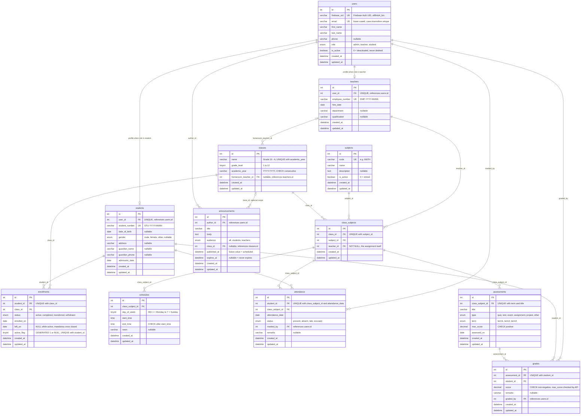

> Part of the design set for the School Management System. The project contract is `docs/PROJECT_PLAN.md`; where this document and the plan disagree, the plan wins (see its Decisions log, section 5).

# 02 — Database Design: School Management System (MySQL 8.0)

**Scope.** The complete relational design for the test project: 12 tables with every UNIQUE / FK / CHECK constraint, the indexes the API needs for search and filtering, the SQL the REST layer runs for the hard parts (current class, rosters, timetable conflicts, attendance %, grade averages, dashboards, announcement visibility, paginated search), a demo seed, and a schema-specific pitfalls list.

**Validated, not just written.** Every statement in this document — `schema.sql`, `seed.sql`, all statements of the key-query file (section D), the optional trigger (B.6), the D9 search module and 30 negative constraint tests — was executed against a local **MySQL 8.0.43** (`sql_mode = ONLY_FULL_GROUP_BY, STRICT_TRANS_TABLES, …`) on a throwaway database on 2026-10-03. The schema applies with **zero warnings**, the seed yields the expected row counts, the seeded timetable has zero conflicts, and every negative test fails with the expected error code (Appendix G). Two statements were amended afterwards to match the decisions log (D0 gained the active-enrollment join, D6 became points-weighted) and are flagged as not re-executed in Appendix G.

**Deliverable files** (all embedded verbatim below, paths relative to `backend/`): `database/schema.sql` (B.1), `database/queries.sql` (D), `src/db/search.js` (D9), `scripts/seed.js` (E.1), `database/seed.sql` (E.2). They are applied with `npm run db:migrate`, `npm run db:seed` and `npm run db:reset` (section E); the `mysql` command-line client is not needed.

---

## 0. Conventions and fixed decisions (applied everywhere)

| Decision | How it is applied |
|---|---|
| MySQL 8.0, InnoDB, `utf8mb4_unicode_ci` | `CREATE DATABASE … DEFAULT COLLATE utf8mb4_unicode_ci`; every table repeats `ENGINE=InnoDB DEFAULT CHARSET=utf8mb4 COLLATE=utf8mb4_unicode_ci`. The 8.0 server default is `utf8mb4_0900_ai_ci`, so this must be explicit. |
| snake_case identifiers | tables, columns and all named objects: `uq_*` unique keys, `idx_*` indexes, `fk_*` foreign keys, `chk_*` check constraints |
| Integer PKs | `id INT UNSIGNED NOT NULL AUTO_INCREMENT` on every table |
| Audit timestamps | `created_at DATETIME NOT NULL DEFAULT CURRENT_TIMESTAMP`, `updated_at DATETIME NOT NULL DEFAULT CURRENT_TIMESTAMP ON UPDATE CURRENT_TIMESTAMP` on every table |
| Roles | `users.role ENUM('admin','teacher','student')`; `teachers` and `students` are 1:1 profile tables (`UNIQUE(user_id)`); admin has no extra table. The API creates the `users` row and the profile row in one transaction, and defaults `students.admission_date` and `teachers.hire_date` to today when the caller omits them (both columns stay `NOT NULL`) |
| Users are deactivated, never deleted | `users.is_active`; every FK pointing at `users`, `teachers` or `students` is `ON DELETE RESTRICT`, so an accidental `DELETE` fails loudly |
| Other entities: hard delete only when no dependents | **every FK is `ON DELETE RESTRICT ON UPDATE RESTRICT`** — justified per FK in B.2 |
| Academic year | `VARCHAR(9)` like `'2025-2026'`; a CHECK enforces the `YYYY-YYYY` format **and** second year = first year + 1 |
| Dates and times | `DATE`, `TIME`, `DATETIME` (no `TIMESTAMP`); mysql2 options `dateStrings: ['DATE']`, `timezone: 'Z'`, `decimalNumbers: true`, plus a `typeCast` that returns TIME columns as `'HH:MM'` and TINYINT(1) as booleans. DATE comes back as a `'YYYY-MM-DD'` string that never shifts; DATETIME columns arrive as JS Dates and serialise as ISO UTC (decision D16) |
| Business numbers | `student_number` `STU-YYYY-NNNN`, `employee_number` `EMP-YYYY-NNNN` — YYYY = year issued (admission / hire year), NNNN = per-year sequence; both `UNIQUE` + format `CHECK` |
| Booleans | written as `BOOLEAN` (stored as `tinyint(1)`); writing `TINYINT(1)` literally raises the 8.0 "integer display width is deprecated" warning |

One deliberate column-level exception to the collation default: **`users.firebase_uid` is `COLLATE utf8mb4_bin`**. A Firebase UID is an opaque, case-sensitive token; under a `_ci` collation `abc` and `ABC` would collide in the UNIQUE index. It keeps the `utf8mb4` charset, so there is no "illegal mix of collations", and `WHERE firebase_uid = ?` is still a `const` index lookup (verified with `EXPLAIN`).

### 0.1 Table overview

| # | Table | One-line purpose | Key rules |
|---|---|---|---|
| 1 | `users` | One account per person of any role: Firebase link (`firebase_uid`), names, phone, `role`, `is_active` | `UNIQUE(firebase_uid)`, `UNIQUE(email)` |
| 2 | `teachers` | Teacher profile, 1:1 with a `users` row | `UNIQUE(user_id)`, `UNIQUE(employee_number)` |
| 3 | `students` | Student profile, 1:1 with a `users` row; **no class column** — the current class is derived from `enrollments` | `UNIQUE(user_id)`, `UNIQUE(student_number)` |
| 4 | `subjects` | Subject catalogue, independent of year and class; `is_active` to retire one | `UNIQUE(code)` |
| 5 | `classes` | A section in one academic year (`Grade 10 - A`, `2025-2026`), optional homeroom teacher | `UNIQUE(academic_year, name)`, year-format CHECK |
| 6 | `class_subjects` | **Teacher assignment**: (class, subject) → teacher; the hub that schedules, attendance and assessments hang off | `UNIQUE(class_id, subject_id)` |
| 7 | `enrollments` | Student ↔ class membership with history (`active / completed / transferred / withdrawn`) | `UNIQUE(student_id, class_id)`, **one active row per student** (generated column + UNIQUE) |
| 8 | `schedules` | Weekly timetable slots per class_subject (ISO weekday, `start_time`, `end_time`, room) | `CHECK (end_time > start_time)`; overlaps prevented by query D4 |
| 9 | `attendance` | One mark per student per class_subject per date, plus who marked it | `UNIQUE(student_id, class_subject_id, attendance_date)` |
| 10 | `assessments` | Graded event of a class_subject: title, type, term, `max_score`, date | `UNIQUE(class_subject_id, term, title)`, `CHECK (max_score > 0)` |
| 11 | `grades` | One score per student per assessment; `max_score` lives on the assessment, never repeated here | `UNIQUE(assessment_id, student_id)`, `CHECK (score >= 0)` |
| 12 | `announcements` | Notice with a role audience and an optional class scope, publish/expiry window | `CHECK (expires_at > published_at)` |

---

## A. ERD



**How to read it.** `class_subjects` is the hub: a teacher assignment *is* a row there, and everything that happens in a lesson — timetable slot, attendance mark, assessment — references that row, never the class or the teacher directly. That is what makes "change the teacher of Maths in 10-A" a one-column `UPDATE` with all history intact, and what lets rosters be derived (`class_subjects.class_id → enrollments WHERE status = 'active'`) instead of being stored twice. `students` has no `class_id` on purpose: the current class is the single `enrollments` row with `status = 'active'`, and that singularity is enforced by the database (B.3).

---

## B. DDL

### B.1 `database/schema.sql`

Dependency order (parents first): users → teachers → students → subjects → classes → class_subjects → enrollments → schedules → attendance → assessments → grades → announcements. Every index carries a comment saying which query needs it.

```sql
-- =============================================================================
-- School Management System — MySQL 8.0 schema
-- Engine: InnoDB | Charset: utf8mb4 | Collation: utf8mb4_unicode_ci
-- Requires MySQL >= 8.0.16 (CHECK constraints are enforced from 8.0.16).
-- Validated on MySQL 8.0.43 with sql_mode = STRICT_TRANS_TABLES,ONLY_FULL_GROUP_BY,...
-- Run:   npm run db:migrate   (scripts/migrate.js executes this file over a
--        dedicated mysql2 connection with multipleStatements: true)
-- Order: tables appear in dependency order (parents before children).
-- Delete policy: every FK is ON DELETE RESTRICT — nothing is ever removed
-- implicitly. Users are deactivated (is_active = 0), never deleted.
-- =============================================================================

CREATE DATABASE IF NOT EXISTS school_management
  DEFAULT CHARACTER SET utf8mb4
  DEFAULT COLLATE utf8mb4_unicode_ci;

USE school_management;

SET NAMES utf8mb4 COLLATE utf8mb4_unicode_ci;

-- -----------------------------------------------------------------------------
-- 1. users — one row per account of ANY role (admin / teacher / student).
--    Identity (password, tokens, MFA) lives in Firebase Auth. This row stores
--    the profile, the role and the active flag, keyed by firebase_uid.
--    Never hard-deleted: the API sets is_active = 0 (and disables the Firebase
--    user) instead.
-- -----------------------------------------------------------------------------
CREATE TABLE IF NOT EXISTS users (
  id            INT UNSIGNED NOT NULL AUTO_INCREMENT,
  firebase_uid  VARCHAR(128) COLLATE utf8mb4_bin NOT NULL
                COMMENT 'Firebase Auth UID. Opaque, case-sensitive => binary collation so abc <> ABC',
  email         VARCHAR(255) NOT NULL
                COMMENT 'Lower-cased by the API before insert; the _ci collation makes the UNIQUE case-insensitive',
  first_name    VARCHAR(100) NOT NULL,
  last_name     VARCHAR(100) NOT NULL,
  phone         VARCHAR(30)  NULL,
  role          ENUM('admin','teacher','student') NOT NULL
                COMMENT 'Single source of truth for RBAC. Immutable after creation',
  is_active     BOOLEAN      NOT NULL DEFAULT TRUE
                COMMENT 'Stored as tinyint(1). 0 = deactivated: API rejects the request even if the Firebase token is valid',
  created_at    DATETIME NOT NULL DEFAULT CURRENT_TIMESTAMP,
  updated_at    DATETIME NOT NULL DEFAULT CURRENT_TIMESTAMP ON UPDATE CURRENT_TIMESTAMP,
  PRIMARY KEY (id),
  UNIQUE KEY uq_users_firebase_uid (firebase_uid),           -- token -> user lookup on EVERY API request
  UNIQUE KEY uq_users_email        (email),                  -- one account per e-mail; search by e-mail
  KEY        idx_users_role_active (role, is_active),        -- "all active teachers", dashboard counts
  KEY        idx_users_name        (last_name, first_name)   -- name search (prefix LIKE) + default sort order
) ENGINE=InnoDB DEFAULT CHARSET=utf8mb4 COLLATE=utf8mb4_unicode_ci
  COMMENT='Accounts of all roles; identity in Firebase, profile + role here';

-- -----------------------------------------------------------------------------
-- 2. teachers — role-specific profile, exactly one row per user with role =
--    'teacher' (enforced 1:1 by UNIQUE(user_id); role match is guaranteed by
--    the API, which inserts users + teachers in one transaction).
-- -----------------------------------------------------------------------------
CREATE TABLE IF NOT EXISTS teachers (
  id               INT UNSIGNED NOT NULL AUTO_INCREMENT,
  user_id          INT UNSIGNED NOT NULL COMMENT '1:1 -> users.id (role = teacher)',
  employee_number  VARCHAR(20)  NOT NULL
                   COMMENT 'EMP-YYYY-NNNN; YYYY = year issued (hire year), NNNN = per-year sequence',
  hire_date        DATE         NOT NULL,
  department       VARCHAR(100) NULL COMMENT 'e.g. Mathematics; what teacher lists filter on',
  qualification    VARCHAR(150) NULL COMMENT 'e.g. B.Ed. Mathematics',
  created_at       DATETIME NOT NULL DEFAULT CURRENT_TIMESTAMP,
  updated_at       DATETIME NOT NULL DEFAULT CURRENT_TIMESTAMP ON UPDATE CURRENT_TIMESTAMP,
  PRIMARY KEY (id),
  UNIQUE KEY uq_teachers_user   (user_id),          -- enforces the 1:1 with users
  UNIQUE KEY uq_teachers_number (employee_number),  -- lookup / search by employee number
  CONSTRAINT fk_teachers_user FOREIGN KEY (user_id) REFERENCES users (id)
    ON DELETE RESTRICT ON UPDATE RESTRICT,          -- users are never deleted; fail loudly if attempted
  CONSTRAINT chk_teachers_number CHECK (employee_number REGEXP '^EMP-[0-9]{4}-[0-9]{4,}$')
) ENGINE=InnoDB DEFAULT CHARSET=utf8mb4 COLLATE=utf8mb4_unicode_ci
  COMMENT='Teacher profile (1:1 with users)';

-- -----------------------------------------------------------------------------
-- 3. students — role-specific profile, exactly one row per user with role =
--    'student'. Which class the student is in is NOT stored here: it is derived
--    from enrollments (status = active) so history is never overwritten.
-- -----------------------------------------------------------------------------
CREATE TABLE IF NOT EXISTS students (
  id              INT UNSIGNED NOT NULL AUTO_INCREMENT,
  user_id         INT UNSIGNED NOT NULL COMMENT '1:1 -> users.id (role = student)',
  student_number  VARCHAR(20)  NOT NULL
                  COMMENT 'STU-YYYY-NNNN; YYYY = admission year, NNNN = per-year sequence (resets yearly)',
  date_of_birth   DATE         NULL,
  gender          ENUM('male','female','other') NULL,
  address         VARCHAR(255) NULL,
  guardian_name   VARCHAR(150) NULL,
  guardian_phone  VARCHAR(30)  NULL,
  admission_date  DATE         NOT NULL,
  created_at      DATETIME NOT NULL DEFAULT CURRENT_TIMESTAMP,
  updated_at      DATETIME NOT NULL DEFAULT CURRENT_TIMESTAMP ON UPDATE CURRENT_TIMESTAMP,
  PRIMARY KEY (id),
  UNIQUE KEY uq_students_user   (user_id),          -- enforces the 1:1 with users
  UNIQUE KEY uq_students_number (student_number),   -- lookup / search by student number
  CONSTRAINT fk_students_user FOREIGN KEY (user_id) REFERENCES users (id)
    ON DELETE RESTRICT ON UPDATE RESTRICT,          -- users are never deleted; fail loudly if attempted
  CONSTRAINT chk_students_number CHECK (student_number REGEXP '^STU-[0-9]{4}-[0-9]{4,}$')
) ENGINE=InnoDB DEFAULT CHARSET=utf8mb4 COLLATE=utf8mb4_unicode_ci
  COMMENT='Student profile (1:1 with users); current class lives in enrollments';

-- -----------------------------------------------------------------------------
-- 4. subjects — master list, independent of year/class ("Mathematics").
--    is_active lets an admin retire a subject that already has history
--    (it cannot be hard-deleted once class_subjects reference it).
-- -----------------------------------------------------------------------------
CREATE TABLE IF NOT EXISTS subjects (
  id           INT UNSIGNED NOT NULL AUTO_INCREMENT,
  code         VARCHAR(20)  NOT NULL COMMENT 'Short unique code, e.g. MATH',
  name         VARCHAR(100) NOT NULL,
  description  TEXT         NULL,
  is_active    BOOLEAN      NOT NULL DEFAULT TRUE COMMENT 'Stored as tinyint(1). 0 = retired, hidden from new assignments',
  created_at   DATETIME NOT NULL DEFAULT CURRENT_TIMESTAMP,
  updated_at   DATETIME NOT NULL DEFAULT CURRENT_TIMESTAMP ON UPDATE CURRENT_TIMESTAMP,
  PRIMARY KEY (id),
  UNIQUE KEY uq_subjects_code (code),   -- business key; lookup by code
  KEY        idx_subjects_name (name)   -- search / sort by name (same name may exist under 2 codes)
) ENGINE=InnoDB DEFAULT CHARSET=utf8mb4 COLLATE=utf8mb4_unicode_ci
  COMMENT='Subject catalogue';

-- -----------------------------------------------------------------------------
-- 5. classes — a section in one academic year ("Grade 10 - A", 2025-2026).
--    A new row is created every year; old rows are history and are never
--    deleted (RESTRICT everywhere). Optional homeroom teacher.
-- -----------------------------------------------------------------------------
CREATE TABLE IF NOT EXISTS classes (
  id                   INT UNSIGNED     NOT NULL AUTO_INCREMENT,
  name                 VARCHAR(50)      NOT NULL COMMENT 'Display label, e.g. "Grade 10 - A"',
  grade_level          TINYINT UNSIGNED NOT NULL COMMENT 'Structured grade for filter/sort (name is free text)',
  academic_year        VARCHAR(9)       NOT NULL COMMENT 'YYYY-YYYY, e.g. 2025-2026 (fixed width => sorts correctly as text)',
  homeroom_teacher_id  INT UNSIGNED     NULL     COMMENT 'Optional class teacher',
  created_at           DATETIME NOT NULL DEFAULT CURRENT_TIMESTAMP,
  updated_at           DATETIME NOT NULL DEFAULT CURRENT_TIMESTAMP ON UPDATE CURRENT_TIMESTAMP,
  PRIMARY KEY (id),
  UNIQUE KEY uq_classes_year_name  (academic_year, name),        -- "Grade 10 - A" exists once per year
  KEY        idx_classes_year_grade (academic_year, grade_level), -- list classes of a year, filter by grade
  KEY        idx_classes_homeroom   (homeroom_teacher_id),        -- FK + "which class is teacher X homeroom of"
  CONSTRAINT fk_classes_homeroom_teacher FOREIGN KEY (homeroom_teacher_id) REFERENCES teachers (id)
    ON DELETE RESTRICT ON UPDATE RESTRICT,   -- teachers are never deleted; SET NULL would hide a bad delete
  CONSTRAINT chk_classes_academic_year CHECK (
    academic_year REGEXP '^[0-9]{4}-[0-9]{4}$'
    AND CAST(SUBSTRING(academic_year, 6, 4) AS UNSIGNED) = CAST(SUBSTRING(academic_year, 1, 4) AS UNSIGNED) + 1
  ),
  CONSTRAINT chk_classes_grade_level CHECK (grade_level BETWEEN 1 AND 12)
) ENGINE=InnoDB DEFAULT CHARSET=utf8mb4 COLLATE=utf8mb4_unicode_ci
  COMMENT='Class section within one academic year';

-- -----------------------------------------------------------------------------
-- 6. class_subjects — TEACHER ASSIGNMENT: "teacher T teaches subject S to
--    class C". One teacher per subject per class (UNIQUE(class_id, subject_id)).
--    Everything that happens in a lesson (schedule slot, attendance, assessment)
--    hangs off this row, so it is the hub of the schema.
--    Changing the teacher is an UPDATE of teacher_id, never delete + insert.
-- -----------------------------------------------------------------------------
CREATE TABLE IF NOT EXISTS class_subjects (
  id          INT UNSIGNED NOT NULL AUTO_INCREMENT,
  class_id    INT UNSIGNED NOT NULL,
  subject_id  INT UNSIGNED NOT NULL,
  teacher_id  INT UNSIGNED NOT NULL COMMENT 'The assignment IS the row, so a teacher is mandatory',
  created_at  DATETIME NOT NULL DEFAULT CURRENT_TIMESTAMP,
  updated_at  DATETIME NOT NULL DEFAULT CURRENT_TIMESTAMP ON UPDATE CURRENT_TIMESTAMP,
  PRIMARY KEY (id),
  UNIQUE KEY uq_class_subjects_class_subject (class_id, subject_id), -- one teacher per subject per class; also serves FK class_id
  KEY        idx_class_subjects_teacher (teacher_id),                 -- "my assignments" for the teacher dashboard
  KEY        idx_class_subjects_subject (subject_id),                 -- FK + "where is subject X taught"
  CONSTRAINT fk_class_subjects_class   FOREIGN KEY (class_id)   REFERENCES classes  (id) ON DELETE RESTRICT ON UPDATE RESTRICT,
  CONSTRAINT fk_class_subjects_subject FOREIGN KEY (subject_id) REFERENCES subjects (id) ON DELETE RESTRICT ON UPDATE RESTRICT,
  CONSTRAINT fk_class_subjects_teacher FOREIGN KEY (teacher_id) REFERENCES teachers (id) ON DELETE RESTRICT ON UPDATE RESTRICT
) ENGINE=InnoDB DEFAULT CHARSET=utf8mb4 COLLATE=utf8mb4_unicode_ci
  COMMENT='Teacher assignment: (class, subject) -> teacher';

-- -----------------------------------------------------------------------------
-- 7. enrollments — student <-> class membership WITH history.
--    Rule: a student has AT MOST ONE active enrollment at any time.
--    Enforced in the database by active_flag (generated: 1 when active, NULL
--    otherwise) + UNIQUE(student_id, active_flag): NULLs never collide in a
--    UNIQUE index, so any number of closed rows coexist with at most one open
--    row. A transfer = close the old row THEN insert the new one (same tx).
-- -----------------------------------------------------------------------------
CREATE TABLE IF NOT EXISTS enrollments (
  id           INT UNSIGNED NOT NULL AUTO_INCREMENT,
  student_id   INT UNSIGNED NOT NULL,
  class_id     INT UNSIGNED NOT NULL,
  status       ENUM('active','completed','transferred','withdrawn') NOT NULL DEFAULT 'active'
               COMMENT 'completed = finished the year; transferred = moved to another class; withdrawn = left school',
  enrolled_on  DATE NOT NULL,
  left_on      DATE NULL COMMENT 'NULL while active; mandatory once closed (see CHECK)',
  active_flag  TINYINT UNSIGNED GENERATED ALWAYS AS (IF(status = 'active', 1, NULL)) STORED
               COMMENT '1 for the active row, NULL otherwise. Exists only to drive uq_enrollments_one_active',
  created_at   DATETIME NOT NULL DEFAULT CURRENT_TIMESTAMP,
  updated_at   DATETIME NOT NULL DEFAULT CURRENT_TIMESTAMP ON UPDATE CURRENT_TIMESTAMP,
  PRIMARY KEY (id),
  UNIQUE KEY uq_enrollments_student_class (student_id, class_id),   -- one row per student per class (re-open the row instead of duplicating)
  UNIQUE KEY uq_enrollments_one_active    (student_id, active_flag), -- THE "one active enrollment" rule
  KEY        idx_enrollments_class_status (class_id, status),       -- roster of a class (active rows); also serves FK class_id
  CONSTRAINT fk_enrollments_student FOREIGN KEY (student_id) REFERENCES students (id) ON DELETE RESTRICT ON UPDATE RESTRICT,
  CONSTRAINT fk_enrollments_class   FOREIGN KEY (class_id)   REFERENCES classes  (id) ON DELETE RESTRICT ON UPDATE RESTRICT,
  CONSTRAINT chk_enrollments_dates  CHECK (left_on IS NULL OR left_on >= enrolled_on),
  CONSTRAINT chk_enrollments_status_left CHECK (
    (status = 'active' AND left_on IS NULL) OR (status <> 'active' AND left_on IS NOT NULL)
  )
) ENGINE=InnoDB DEFAULT CHARSET=utf8mb4 COLLATE=utf8mb4_unicode_ci
  COMMENT='Student membership in a class, with history; at most one active row per student';

-- -----------------------------------------------------------------------------
-- 8. schedules — weekly timetable slots of a class_subject.
--    day_of_week is ISO 8601 (1 = Monday ... 7 = Sunday). Overlap prevention
--    (same class / same teacher / same room) is a query at insert/update time
--    (see key query D4); a UNIQUE/CHECK cannot express interval overlap.
-- -----------------------------------------------------------------------------
CREATE TABLE IF NOT EXISTS schedules (
  id                INT UNSIGNED     NOT NULL AUTO_INCREMENT,
  class_subject_id  INT UNSIGNED     NOT NULL,
  day_of_week       TINYINT UNSIGNED NOT NULL COMMENT 'ISO 8601: 1 = Monday ... 7 = Sunday (MySQL WEEKDAY()+1)',
  start_time        TIME             NOT NULL,
  end_time          TIME             NOT NULL,
  room              VARCHAR(50)      NULL COMMENT 'Free text; normalised (trimmed) by the API. NULL = unassigned',
  created_at        DATETIME NOT NULL DEFAULT CURRENT_TIMESTAMP,
  updated_at        DATETIME NOT NULL DEFAULT CURRENT_TIMESTAMP ON UPDATE CURRENT_TIMESTAMP,
  PRIMARY KEY (id),
  UNIQUE KEY uq_schedules_cs_day_start (class_subject_id, day_of_week, start_time), -- exact duplicate slot guard; also serves FK
  KEY        idx_schedules_day_time    (day_of_week, start_time, end_time),         -- "today's timetable", overlap scan per day
  KEY        idx_schedules_room_day    (room, day_of_week),                         -- room conflict check
  CONSTRAINT fk_schedules_class_subject FOREIGN KEY (class_subject_id) REFERENCES class_subjects (id)
    ON DELETE RESTRICT ON UPDATE RESTRICT,   -- removing an assignment must clear its timetable explicitly first
  CONSTRAINT chk_schedules_day  CHECK (day_of_week BETWEEN 1 AND 7),
  CONSTRAINT chk_schedules_time CHECK (end_time > start_time)
) ENGINE=InnoDB DEFAULT CHARSET=utf8mb4 COLLATE=utf8mb4_unicode_ci
  COMMENT='Weekly timetable slots';

-- -----------------------------------------------------------------------------
-- 9. attendance — one row per student per class_subject per date.
--    Marked by a user (the teacher of the class_subject or an admin).
--    Marking is an upsert on the UNIQUE key (re-marking corrects the row).
-- -----------------------------------------------------------------------------
CREATE TABLE IF NOT EXISTS attendance (
  id                INT UNSIGNED NOT NULL AUTO_INCREMENT,
  student_id        INT UNSIGNED NOT NULL,
  class_subject_id  INT UNSIGNED NOT NULL,
  attendance_date   DATE         NOT NULL,
  status            ENUM('present','absent','late','excused') NOT NULL,
  marked_by         INT UNSIGNED NOT NULL COMMENT 'users.id of the teacher/admin who marked (audit)',
  remarks           VARCHAR(255) NULL,
  created_at        DATETIME NOT NULL DEFAULT CURRENT_TIMESTAMP,
  updated_at        DATETIME NOT NULL DEFAULT CURRENT_TIMESTAMP ON UPDATE CURRENT_TIMESTAMP,
  PRIMARY KEY (id),
  UNIQUE KEY uq_attendance_student_cs_date (student_id, class_subject_id, attendance_date), -- one mark per student/lesson/day; serves FK student_id; student summaries
  KEY        idx_attendance_cs_date        (class_subject_id, attendance_date),             -- teacher's register for a lesson/date; FK class_subject_id
  KEY        idx_attendance_date_status    (attendance_date, status),                       -- admin "today" summary, date-range reports
  KEY        idx_attendance_marked_by      (marked_by),                                     -- FK
  CONSTRAINT fk_attendance_student       FOREIGN KEY (student_id)       REFERENCES students       (id) ON DELETE RESTRICT ON UPDATE RESTRICT,
  CONSTRAINT fk_attendance_class_subject FOREIGN KEY (class_subject_id) REFERENCES class_subjects (id) ON DELETE RESTRICT ON UPDATE RESTRICT,
  CONSTRAINT fk_attendance_marked_by     FOREIGN KEY (marked_by)        REFERENCES users          (id) ON DELETE RESTRICT ON UPDATE RESTRICT
) ENGINE=InnoDB DEFAULT CHARSET=utf8mb4 COLLATE=utf8mb4_unicode_ci
  COMMENT='Daily attendance per student per class_subject';

-- -----------------------------------------------------------------------------
-- 10. assessments — a graded event of a class_subject (quiz, exam, ...).
--     max_score lives HERE once, not on every grade row (normalised).
-- -----------------------------------------------------------------------------
CREATE TABLE IF NOT EXISTS assessments (
  id                INT UNSIGNED NOT NULL AUTO_INCREMENT,
  class_subject_id  INT UNSIGNED NOT NULL,
  title             VARCHAR(150) NOT NULL,
  type              ENUM('quiz','test','exam','assignment','project','other') NOT NULL,
  term              ENUM('term1','term2','term3') NOT NULL,
  max_score         DECIMAL(6,2) NOT NULL COMMENT 'Exact decimal, never FLOAT. Grades are validated against it by the API',
  assessed_on       DATE         NOT NULL,
  created_at        DATETIME NOT NULL DEFAULT CURRENT_TIMESTAMP,
  updated_at        DATETIME NOT NULL DEFAULT CURRENT_TIMESTAMP ON UPDATE CURRENT_TIMESTAMP,
  PRIMARY KEY (id),
  UNIQUE KEY uq_assessments_cs_term_title (class_subject_id, term, title), -- no accidental double-create; serves FK; per-term listing
  KEY        idx_assessments_date         (assessed_on),                   -- date-range filters / "recent assessments"
  CONSTRAINT fk_assessments_class_subject FOREIGN KEY (class_subject_id) REFERENCES class_subjects (id)
    ON DELETE RESTRICT ON UPDATE RESTRICT,
  CONSTRAINT chk_assessments_max_score CHECK (max_score > 0)
) ENGINE=InnoDB DEFAULT CHARSET=utf8mb4 COLLATE=utf8mb4_unicode_ci
  COMMENT='Graded events (quiz/test/exam/...) of a class_subject';

-- -----------------------------------------------------------------------------
-- 11. grades — one score per student per assessment.
--     score <= assessments.max_score cannot be a CHECK (cross-table): the API
--     validates it inside the same transaction (optional trigger backstop in
--     the design document).
-- -----------------------------------------------------------------------------
CREATE TABLE IF NOT EXISTS grades (
  id             INT UNSIGNED NOT NULL AUTO_INCREMENT,
  assessment_id  INT UNSIGNED NOT NULL,
  student_id     INT UNSIGNED NOT NULL,
  score          DECIMAL(6,2) NOT NULL,
  remarks        VARCHAR(255) NULL,
  graded_by      INT UNSIGNED NOT NULL COMMENT 'users.id of the teacher/admin who entered the score (audit)',
  created_at     DATETIME NOT NULL DEFAULT CURRENT_TIMESTAMP,
  updated_at     DATETIME NOT NULL DEFAULT CURRENT_TIMESTAMP ON UPDATE CURRENT_TIMESTAMP,
  PRIMARY KEY (id),
  UNIQUE KEY uq_grades_assessment_student (assessment_id, student_id), -- one score per student per assessment; serves FK assessment_id
  KEY        idx_grades_student           (student_id),                -- student's grade summary / report card
  KEY        idx_grades_graded_by         (graded_by),                 -- FK
  CONSTRAINT fk_grades_assessment FOREIGN KEY (assessment_id) REFERENCES assessments (id)
    ON DELETE RESTRICT ON UPDATE RESTRICT,   -- deleting an assessment with grades is an explicit 2-step in the API
  CONSTRAINT fk_grades_student    FOREIGN KEY (student_id)    REFERENCES students (id) ON DELETE RESTRICT ON UPDATE RESTRICT,
  CONSTRAINT fk_grades_graded_by  FOREIGN KEY (graded_by)     REFERENCES users    (id) ON DELETE RESTRICT ON UPDATE RESTRICT,
  CONSTRAINT chk_grades_score CHECK (score >= 0)
) ENGINE=InnoDB DEFAULT CHARSET=utf8mb4 COLLATE=utf8mb4_unicode_ci
  COMMENT='Scores per student per assessment';

-- -----------------------------------------------------------------------------
-- 12. announcements — audience = role filter, class_id = optional class scope.
--     Visible when published_at <= now < expires_at (NULL = never expires).
--     class_id is RESTRICT on purpose: SET NULL would silently turn a
--     class-targeted notice into a school-wide one.
-- -----------------------------------------------------------------------------
CREATE TABLE IF NOT EXISTS announcements (
  id            INT UNSIGNED NOT NULL AUTO_INCREMENT,
  author_id     INT UNSIGNED NOT NULL COMMENT 'users.id (admin or teacher)',
  title         VARCHAR(200) NOT NULL,
  body          TEXT         NOT NULL,
  audience      ENUM('all','students','teachers') NOT NULL DEFAULT 'all',
  class_id      INT UNSIGNED NULL COMMENT 'NULL = school-wide; set = only members of that class',
  published_at  DATETIME NOT NULL DEFAULT CURRENT_TIMESTAMP COMMENT 'Future value = scheduled (hidden until then)',
  expires_at    DATETIME NULL COMMENT 'NULL = never expires',
  created_at    DATETIME NOT NULL DEFAULT CURRENT_TIMESTAMP,
  updated_at    DATETIME NOT NULL DEFAULT CURRENT_TIMESTAMP ON UPDATE CURRENT_TIMESTAMP,
  PRIMARY KEY (id),
  KEY idx_announcements_published          (published_at),            -- feed ordering (newest first) + visibility window
  KEY idx_announcements_audience_published (audience, published_at),  -- admin filter by audience
  KEY idx_announcements_class              (class_id),                -- FK + class-targeted feed
  KEY idx_announcements_author             (author_id),               -- FK + "my announcements"
  CONSTRAINT fk_announcements_author FOREIGN KEY (author_id) REFERENCES users   (id) ON DELETE RESTRICT ON UPDATE RESTRICT,
  CONSTRAINT fk_announcements_class  FOREIGN KEY (class_id)  REFERENCES classes (id) ON DELETE RESTRICT ON UPDATE RESTRICT,
  CONSTRAINT chk_announcements_expiry CHECK (expires_at IS NULL OR expires_at > published_at)
) ENGINE=InnoDB DEFAULT CHARSET=utf8mb4 COLLATE=utf8mb4_unicode_ci
  COMMENT='Announcements with role audience and optional class scope';
```

### B.2 Foreign keys and ON DELETE policy (all 18 FKs)

Every FK is `ON DELETE RESTRICT ON UPDATE RESTRICT`. CASCADE and SET NULL were considered for each one and rejected for the reason given. "RESTRICT" means the API either refuses the delete (HTTP 409, listing the dependents) or performs an explicit, confirmed multi-statement delete inside one transaction (query D12).

| Child column → parent | Policy | Why not CASCADE / SET NULL |
|---|---|---|
| `teachers.user_id → users` | RESTRICT | Users are never deleted; a cascade would let an accidental user delete erase a teacher silently. |
| `students.user_id → users` | RESTRICT | Same, and it shields all attendance/grade history hanging off the student. |
| `classes.homeroom_teacher_id → teachers` | RESTRICT | SET NULL is semantically possible but would hide the fact that someone tried to delete a teacher; teachers are deactivated, not deleted, so the API never reaches this path. |
| `class_subjects.class_id → classes` | RESTRICT | A class with assignments has (or will have) lessons; deleting it must be a deliberate clean-up of an empty year, not a cascade. |
| `class_subjects.subject_id → subjects` | RESTRICT | Retire a subject with `is_active = 0`; deleting would orphan history. |
| `class_subjects.teacher_id → teachers` | RESTRICT | Reassign (`UPDATE teacher_id`) before deactivating a teacher; the row *is* the assignment so it must always have one. |
| `enrollments.student_id → students` | RESTRICT | Enrollment history is the student's academic record. |
| `enrollments.class_id → classes` | RESTRICT | Same, from the class side. |
| `schedules.class_subject_id → class_subjects` | RESTRICT | Removing an assignment must clear its timetable explicitly (the API does it in one transaction) so a mis-click cannot wipe a timetable. |
| `attendance.student_id → students` | RESTRICT | Attendance is audit data; never cascaded. |
| `attendance.class_subject_id → class_subjects` | RESTRICT | An assignment with attendance can only be re-pointed (`UPDATE teacher_id`), never deleted. |
| `attendance.marked_by → users` | RESTRICT | Audit trail of who marked. |
| `assessments.class_subject_id → class_subjects` | RESTRICT | Grades hang off assessments — see next row. |
| `grades.assessment_id → assessments` | RESTRICT (deliberate; CASCADE was the only serious alternative) | Grades are a weak entity of the assessment, so CASCADE would be *modelled* correctly — but it lets one `DELETE` erase a class's marks with no second look. RESTRICT forces the API into the explicit, confirmed two-step of D12, which is what a school wants. Switching to CASCADE later is a one-line `ALTER`. |
| `grades.student_id → students` | RESTRICT | Academic record. |
| `grades.graded_by → users` | RESTRICT | Audit trail. |
| `announcements.author_id → users` | RESTRICT | Authorship audit. |
| `announcements.class_id → classes` | RESTRICT | **SET NULL would be a real bug**: a class-targeted notice would silently become school-wide, because `class_id IS NULL` means "everyone". |

`ON UPDATE RESTRICT` everywhere: PKs are surrogate auto-increments and never change, so there is nothing to cascade and an attempt to change one should fail.

### B.3 "At most one active enrollment per student" — options and recommendation

| Option | How | Verdict |
|---|---|---|
| **A. Generated column + UNIQUE index (chosen)** | `active_flag TINYINT UNSIGNED GENERATED ALWAYS AS (IF(status = 'active', 1, NULL)) STORED` plus `UNIQUE KEY uq_enrollments_one_active (student_id, active_flag)`. Closed rows have `active_flag = NULL`, and NULLs never collide in a MySQL UNIQUE index, so any number of closed rows coexist with at most one open row. | Enforced by InnoDB under any concurrency, for every code path (API, admin SQL, imports). Zero application logic. Verified: a second active insert → `ERROR 1062 … uq_enrollments_one_active`; re-activating a closed row while another is active → 1062 (tests N01, N30). |
| B. Application check in a transaction | `START TRANSACTION; SELECT id FROM students WHERE id = ? FOR UPDATE; SELECT … FROM enrollments WHERE student_id = ? AND status = 'active'; INSERT …; COMMIT;` | Correct only if *every* writer remembers to lock the parent `students` row first — locking the enrollment rows is not enough, because a student with no rows has nothing to lock and two concurrent inserts both pass. Fragile; keep it only as the *workflow* on top of A. |
| C. `students.current_enrollment_id` pointer | FK from students to enrollments | Two sources of truth, a circular FK, and still needs application code to stay in sync. Rejected. |
| D. Trigger | `BEFORE INSERT/UPDATE` counting active rows and `SIGNAL`-ing | Hidden logic, harder to test, and still racy without explicit locking. Rejected. |

**Recommendation: A**, with every transfer/promotion written as "close the old row, then insert the new row" in one transaction (query D10). The order matters: inserting first is rejected by the unique index — which is exactly the safety net. Map `ER_DUP_ENTRY` (1062) on `uq_enrollments_one_active` to HTTP 409 `CONFLICT` "student already has an active enrollment".

In the API, `POST /enrollments/transfer` implements D10: it closes the active row as `transferred` and then inserts the new row — or re-opens the existing closed row for that class, because `UNIQUE(student_id, class_id)` forbids a second row for the same student and class. `PATCH /enrollments/:id` closes a row by setting `completed` or `withdrawn` together with `left_on = today`.

Why `STORED` rather than `VIRTUAL`: both accept UNIQUE indexes in 8.0; STORED keeps the index maintenance obvious and costs one tiny column. Why a flag rather than a generated copy of `student_id`: `(student_id, active_flag)` reads as the rule it enforces.

Two further CHECKs make the status model self-consistent: `left_on IS NULL OR left_on >= enrolled_on`, and `(status = 'active' AND left_on IS NULL) OR (status <> 'active' AND left_on IS NOT NULL)` — an open row never has a leave date, a closed row always does. `UNIQUE(student_id, class_id)` means a student who withdraws and comes back to the same class re-opens the existing row instead of creating a duplicate.

### B.4 Index rationale (search, filter, sort, joins)

Every FK column is covered by an index — its own, or as the leftmost column of a UNIQUE/composite key — which InnoDB requires anyway and which the roster/report joins use. The indexes that exist for search, filtering and ordering:

| Index | Serves |
|---|---|
| `users.uq_users_firebase_uid` | the per-request auth lookup (`EXPLAIN`: `type = const`) |
| `users.uq_users_email` | login-by-e-mail lookups, duplicate prevention, admin search by e-mail |
| `users.idx_users_name (last_name, first_name)` | name search with prefix `LIKE 'Oka%'`, default sort of every people list |
| `users.idx_users_role_active (role, is_active)` | "all active teachers", dashboard counts |
| `students.uq_students_number`, `teachers.uq_teachers_number` | search / lookup by business number |
| `subjects.uq_subjects_code`, `subjects.idx_subjects_name` | lookup by code, search / sort by name |
| `classes.uq_classes_year_name`, `classes.idx_classes_year_grade` | class lists per academic year, filtered by grade |
| `class_subjects.idx_class_subjects_teacher` | teacher dashboard ("my lessons") |
| `enrollments.idx_enrollments_class_status (class_id, status)` | rosters (`class_id = ? AND status = 'active'`), class sizes |
| `schedules.idx_schedules_day_time (day_of_week, start_time, end_time)` | today's timetable, overlap scan for one day |
| `schedules.idx_schedules_room_day (room, day_of_week)` | room conflicts, "where is Lab 1 used" |
| `attendance.uq_attendance_student_cs_date` | per-student summaries (leftmost `student_id`) |
| `attendance.idx_attendance_cs_date (class_subject_id, attendance_date)` | the teacher's register for a lesson and date; the `EXISTS` checks in D7c/D7d |
| `attendance.idx_attendance_date_status (attendance_date, status)` | admin "today" summary and date-range reports |
| `assessments.idx_assessments_date` | "recent assessments", date filters |
| `grades.idx_grades_student` | report cards / grade summaries per student |
| `announcements.idx_announcements_published`, `…_audience_published`, `…_class` | feed ordering by date, admin filters, class-targeted feeds |

Full-text search was deliberately left out: a school has thousands of rows, not millions, so `%term%` scans on `users` are instant at that scale; `FULLTEXT(first_name, last_name)` is a drop-in later if ever needed.

### B.5 Rules the schema cannot express (enforced by the API inside the same transaction)

| Rule | Why not a constraint | Where enforced |
|---|---|---|
| `grades.score <= assessments.max_score` | a CHECK cannot reference another table | D6c: `SELECT max_score … FOR SHARE`, validate, write — one transaction. Re-validate when `max_score` is lowered on an assessment that already has grades. Optional DB backstop: B.6 triggers. |
| `students.user_id` must point at a user with `role = 'student'` (same for teachers) | cross-table | The API creates the `users` row and the profile row in one transaction and exposes no endpoint that changes `role`. (Hardening option if ever needed: `UNIQUE(users.id, role)` + composite FK `(user_id, role)` with `role` fixed by a CHECK.) |
| Attendance / grade rows only for students enrolled in the lesson's class | cross-table | Guard query D11 before writing; bulk marks are built from the roster query D2. |
| No overlapping timetable slots for a class / teacher / room | interval overlap is not expressible as UNIQUE or CHECK | D4 inside the insert/update transaction; serialise concurrent timetable edits with `GET_LOCK('timetable', 5)`. |
| A deactivated teacher has no current assignments | business workflow | The deactivate endpoint refuses (409) while `class_subjects.teacher_id` / `classes.homeroom_teacher_id` reference the teacher in the current academic year, or takes a replacement teacher id and reassigns first. |
| `announcements.audience` × `class_id` combinations | every combination is meaningful (e.g. `teachers` + class = "the teachers of 10-A") | nothing to enforce; the visibility queries D8 / D8b apply both filters with AND. |

### B.6 Optional trigger backstop for `score <= max_score`

Not part of `schema.sql` (the `mysql` client needs `DELIMITER` for multi-statement bodies, and the API already validates), but a database-level net is cheap. Validated on 8.0.43: inserting 25.00 against `max_score = 20.00` fails with `ERROR 1644 (45000): score exceeds assessment max_score`, 20.00 is accepted, and updating to 20.01 fails.

```sql
DELIMITER $$
CREATE TRIGGER trg_grades_score_max_ins BEFORE INSERT ON grades FOR EACH ROW
BEGIN
  IF NEW.score > (SELECT max_score FROM assessments WHERE id = NEW.assessment_id) THEN
    SIGNAL SQLSTATE '45000' SET MESSAGE_TEXT = 'score exceeds assessment max_score';
  END IF;
END$$
CREATE TRIGGER trg_grades_score_max_upd BEFORE UPDATE ON grades FOR EACH ROW
BEGIN
  IF NEW.score > (SELECT max_score FROM assessments WHERE id = NEW.assessment_id) THEN
    SIGNAL SQLSTATE '45000' SET MESSAGE_TEXT = 'score exceeds assessment max_score';
  END IF;
END$$
DELIMITER ;
```

---

## C. Feature → table mapping (all 14 requirements)

| # | Required feature | Tables / constraints that implement it | Key SQL |
|---|---|---|---|
| 1 | Student, teacher and administrator accounts | `users` (`role` ENUM, `is_active`), `students` and `teachers` 1:1 profiles (`UNIQUE(user_id)`); an admin is a `users` row only | D0 |
| 2 | Firebase Authentication | `users.firebase_uid UNIQUE NOT NULL` (`utf8mb4_bin`), `users.email UNIQUE`; the API verifies the ID token and maps uid → `users` row; accounts are created with the Admin SDK before the row exists (E, `scripts/seed.js`) | D0 |
| 3 | MySQL database | `schema.sql`: 12 InnoDB tables, `utf8mb4_unicode_ci`, 18 FKs, 15 UNIQUE keys, 11 CHECK constraints, 1 generated column | B.1 |
| 4 | Backend REST API | Every resource maps to one table (resource map at the end of D); mysql2 with positional `?` placeholders; transactions for every multi-row write | D |
| 5 | Student enrollment and profile management | `students` (profile fields, `student_number`), `enrollments` (status history + one-active rule), `users` (contact fields) | D1, D9, D10 |
| 6 | Subjects and class management | `subjects` (`code`, `is_active`), `classes` (`academic_year`, `grade_level`, `homeroom_teacher_id`, `UNIQUE(academic_year, name)`) | D3 |
| 7 | Teacher assignment | `class_subjects (class_id, subject_id, teacher_id NOT NULL)` with `UNIQUE(class_id, subject_id)` → exactly one teacher per subject per class | D3, D11 |
| 8 | Attendance tracking | `attendance` (`UNIQUE(student_id, class_subject_id, attendance_date)`, status ENUM, `marked_by`) | D5, D5b, D5c |
| 9 | Grade management | `assessments` (title, type, term, `max_score`, date) + `grades` (`UNIQUE(assessment_id, student_id)`, `score`, `graded_by`) — `max_score` stored once per assessment | D6, D6b, D6c, D12 |
| 10 | Class schedules | `schedules` (ISO `day_of_week`, `start_time`, `end_time`, `room`, `CHECK (end_time > start_time)`) + conflict detection | D4, D4b, D7e |
| 11 | Announcements | `announcements` (`audience` ENUM, optional `class_id`, `published_at`, `expires_at`, `author_id`) | D8, D8b |
| 12 | Separate student / teacher / admin dashboards | Aggregates over the tables above: admin counts + today's attendance + unmarked lessons (D7, D7b, D7c); teacher assignments + today's lessons with marked flags (D3, D7d); student class, timetable, attendance %, grades, notices (D1, D7e, D5, D6, D6b, D8) | D7 family |
| 13 | Search and filtering | Indexes in B.4 (`users` name / e-mail, `student_number`, `employee_number`, `subjects.name`, `classes(academic_year, grade_level)`, `enrollments(class_id, status)`, `attendance` dates) + the whitelisted-sort / placeholder pattern | D9 |
| 14 | Role-based access control | `users.role` ENUM + `is_active` as the single source of truth; per-request lookup D0; ownership guard queries D11; policy matrix at the end of D | D0, D11 |

---

## D. Key queries

**mysql2 configuration assumed by every query** (decision D16):

```js
const pool = mysql.createPool({
  host, user, password, database: 'school_management',
  charset: 'utf8mb4_unicode_ci',
  namedPlaceholders: true,   // :student_id style, used by the illustrative queries below so a name can repeat
  dateStrings: ['DATE'],     // DATE -> 'YYYY-MM-DD' string (never shifts); DATETIME -> JS Date, serialised as ISO UTC
  timezone: 'Z',             // DATETIME <-> JS Date conversion happens in UTC
  decimalNumbers: true,      // DECIMAL(6,2) -> JS number (safe at this magnitude)
  typeCast(field, next) {    // TIME -> 'HH:MM'; TINYINT(1) -> boolean; everything else -> driver default
    if (field.type === 'TIME') { const v = field.string(); return v == null ? v : v.slice(0, 5); }
    if (field.type === 'TINY' && field.length === 1) { const v = field.string(); return v == null ? v : v === '1'; }
    return next();
  },
  connectionLimit: 10,
});
pool.on('connection', (conn) => conn.query("SET time_zone = '+00:00'")); // CURRENT_TIMESTAMP in UTC
```

The application itself runs the pool with `namedPlaceholders: false` and positional `?` placeholders (repositories pass arrays); the `:name` form in `queries.sql` is kept because it makes a repeated parameter readable. Only the migrate and seed scripts open a `multipleStatements: true` connection, and never the pool.

The API computes `:today`, `:now`, `:iso_dow` (1 = Monday … 7 = Sunday) and `:academic_year` in the **school's time zone** and passes them in; no query relies on the DB session's `CURDATE()` / `NOW()`. `:academic_year` comes from one helper that encodes the August boundary — the same rule `seed.sql` uses:

```js
const ACADEMIC_YEAR_START_MONTH = 8;                 // August
function currentAcademicYear(d = new Date()) {       // d is already in the school's time zone
  const y = d.getFullYear();
  const start = d.getMonth() + 1 >= ACADEMIC_YEAR_START_MONTH ? y : y - 1;
  return `${start}-${start + 1}`;                    // e.g. '2026-2027'
}
const isoDow = (d) => ((d.getDay() + 6) % 7) + 1;    // JS 0 = Sunday  ->  ISO 1 = Monday ... 7 = Sunday
```

The file below is exactly what was executed during validation (with `:name` rewritten to `@name` and `COMMIT` to `ROLLBACK`). D9 is JavaScript and follows the file.

### D0–D12: `database/queries.sql`

```sql
-- ============================================================================
-- D. Key queries used by the REST API.
--    Placeholders are written in mysql2 named-placeholder syntax (:name) for
--    readability (the same name may appear several times in one statement);
--    the application binds them as positional `?` parameters.
--    The API computes :today / :now / :iso_dow / :academic_year itself in the
--    school's time zone and never relies on CURDATE()/NOW() of the DB session.
-- ============================================================================

-- D0. Auth lookup — once per request, right after getAuth().verifyIdToken().
--     One query supplies role, is_active, student_id, teacher_id and the
--     student's active class (active_class_id). The enrollments join yields at
--     most one row thanks to uq_enrollments_one_active and NULL for teachers,
--     admins and students without a class.
SELECT u.id, u.role, u.is_active, u.first_name, u.last_name,
       s.id AS student_id, t.id AS teacher_id, e.class_id AS active_class_id
FROM users u
LEFT JOIN students s    ON s.user_id = u.id
LEFT JOIN teachers t    ON t.user_id = u.id
LEFT JOIN enrollments e ON e.student_id = s.id AND e.status = 'active'
WHERE u.firebase_uid = :firebase_uid;

-- D1. Current class of a student (0 or 1 row — guaranteed by uq_enrollments_one_active)
SELECT c.id AS class_id, c.name AS class_name, c.grade_level, c.academic_year,
       e.id AS enrollment_id, e.enrolled_on,
       CONCAT(hu.first_name, ' ', hu.last_name) AS homeroom_teacher
FROM enrollments e
JOIN classes c        ON c.id  = e.class_id
LEFT JOIN teachers ht ON ht.id = c.homeroom_teacher_id
LEFT JOIN users hu    ON hu.id = ht.user_id
WHERE e.student_id = :student_id
  AND e.status = 'active';

-- D2. Roster of a class_subject = students actively enrolled in its class
SELECT s.id AS student_id, s.student_number, u.first_name, u.last_name, u.email, u.is_active
FROM class_subjects cs
JOIN enrollments e ON e.class_id = cs.class_id AND e.status = 'active'
JOIN students s    ON s.id = e.student_id
JOIN users u       ON u.id = s.user_id
WHERE cs.id = :class_subject_id
ORDER BY u.last_name, u.first_name;

-- D3. Teacher's assignments with class + subject names (+ roster size)
SELECT cs.id AS class_subject_id,
       c.id   AS class_id,   c.name   AS class_name, c.grade_level, c.academic_year,
       sub.id AS subject_id, sub.code AS subject_code, sub.name AS subject_name,
       (SELECT COUNT(*) FROM enrollments e
         WHERE e.class_id = c.id AND e.status = 'active') AS student_count
FROM class_subjects cs
JOIN classes  c   ON c.id   = cs.class_id
JOIN subjects sub ON sub.id = cs.subject_id
WHERE cs.teacher_id = :teacher_id
  AND c.academic_year = :academic_year
ORDER BY c.grade_level, c.name, sub.name;

-- D4. Schedule conflict detection (class, teacher, room) — run inside the
--     insert/update transaction; any returned row => HTTP 409 with details.
--     Overlap rule for half-open intervals [start, end):
--         existing.start_time < new.end_time AND existing.end_time > new.start_time
--     (back-to-back 08:50 -> 08:50 is NOT a conflict).
--     :exclude_id = NULL on insert, the row's own id on update.
SELECT s.id AS schedule_id, s.day_of_week, s.start_time, s.end_time, s.room,
       c.name AS class_name, sub.name AS subject_name, cs.teacher_id,
       CONCAT_WS(',',
         IF(cs.class_id   = target.class_id,   'class',   NULL),
         IF(cs.teacher_id = target.teacher_id, 'teacher', NULL),
         IF(s.room IS NOT NULL AND s.room = :room, 'room', NULL)
       ) AS conflict_types
FROM class_subjects target                       -- the assignment being scheduled
JOIN schedules s
  ON  s.day_of_week = :day_of_week
  AND s.start_time  < :end_time
  AND s.end_time    > :start_time
  AND (:exclude_id IS NULL OR s.id <> :exclude_id)
JOIN class_subjects cs ON cs.id  = s.class_subject_id
JOIN classes  c        ON c.id   = cs.class_id
JOIN subjects sub      ON sub.id = cs.subject_id
WHERE target.id = :class_subject_id
  AND (   cs.class_id   = target.class_id                 -- same class double-booked
       OR cs.teacher_id = target.teacher_id               -- same teacher double-booked
       OR (s.room IS NOT NULL AND s.room = :room));       -- same room double-booked

-- D4b. Timetable integrity report (admin): every overlapping pair in the whole
--      timetable (useful after bulk imports). Expected result: 0 rows.
SELECT a.id AS schedule_a, b.id AS schedule_b, a.day_of_week,
       a.start_time, a.end_time, b.start_time AS b_start, b.end_time AS b_end,
       CONCAT_WS(',',
         IF(csa.class_id   = csb.class_id,   'class',   NULL),
         IF(csa.teacher_id = csb.teacher_id, 'teacher', NULL),
         IF(a.room IS NOT NULL AND a.room = b.room, 'room', NULL)
       ) AS conflict_types
FROM schedules a
JOIN schedules b        ON b.day_of_week = a.day_of_week AND b.id > a.id
                       AND a.start_time < b.end_time AND a.end_time > b.start_time
JOIN class_subjects csa ON csa.id = a.class_subject_id
JOIN class_subjects csb ON csb.id = b.class_subject_id
WHERE csa.class_id = csb.class_id
   OR csa.teacher_id = csb.teacher_id
   OR (a.room IS NOT NULL AND a.room = b.room);

-- D5. Student attendance summary per class_subject.
--     present_pct counts only 'present'; attended_pct counts present + late.
--     API (decision D17): GET /attendance/summary exposes rate = (present + late) / total
--     with 4 decimals (null when nothing is marked) plus the per-status counts;
--     attended_pct is that rate as a percentage.
SELECT cs.id AS class_subject_id, sub.name AS subject_name, c.name AS class_name,
       COUNT(*)                                                        AS sessions_marked,
       SUM(a.status = 'present')                                       AS present_count,
       SUM(a.status = 'late')                                          AS late_count,
       SUM(a.status = 'absent')                                        AS absent_count,
       SUM(a.status = 'excused')                                       AS excused_count,
       ROUND(100 * SUM(a.status = 'present') / COUNT(*), 1)            AS present_pct,
       ROUND(100 * SUM(a.status IN ('present','late')) / COUNT(*), 1) AS attended_pct
FROM attendance a
JOIN class_subjects cs ON cs.id  = a.class_subject_id
JOIN subjects sub      ON sub.id = cs.subject_id
JOIN classes  c        ON c.id   = cs.class_id
WHERE a.student_id = :student_id
  AND a.attendance_date BETWEEN :from_date AND :to_date
GROUP BY cs.id, sub.name, c.name
ORDER BY sub.name;

-- D5b. Teacher view: register of one lesson on one date (roster LEFT JOIN marks;
--      NULL status = not yet marked)
SELECT s.id AS student_id, s.student_number, u.first_name, u.last_name, a.status, a.remarks
FROM class_subjects cs
JOIN enrollments e     ON e.class_id = cs.class_id AND e.status = 'active'
JOIN students s        ON s.id = e.student_id
JOIN users u           ON u.id = s.user_id
LEFT JOIN attendance a ON a.class_subject_id = cs.id
                      AND a.student_id = s.id
                      AND a.attendance_date = :date
WHERE cs.id = :class_subject_id
ORDER BY u.last_name, u.first_name;

-- D5c. Marking attendance = idempotent bulk upsert on the UNIQUE key
--      (row alias syntax needs MySQL >= 8.0.19; VALUES() is deprecated)
INSERT INTO attendance (student_id, class_subject_id, attendance_date, status, marked_by, remarks)
VALUES (:student_id_1, :class_subject_id, :date, :status_1, :marked_by, :remarks_1),
       (:student_id_2, :class_subject_id, :date, :status_2, :marked_by, :remarks_2)
AS new
ON DUPLICATE KEY UPDATE status = new.status, marked_by = new.marked_by, remarks = new.remarks;

-- D6. Student grade summary per class_subject per term (GET /grades/summary).
--     Method: POINTS-WEIGHTED (decision D18) — SUM(score) / SUM(max_score) over
--     the graded assessments, expressed as a percentage, so a 50-point exam
--     counts more than a 10-point quiz. (A simple average of per-assessment
--     percentages, AVG(score / max_score), is NOT used.)
SELECT cs.id AS class_subject_id, sub.name AS subject_name, c.name AS class_name, a.term,
       COUNT(g.id)                                       AS graded_assessments,
       SUM(g.score)                                      AS total_score,
       SUM(a.max_score)                                  AS total_max_score,
       ROUND(100 * SUM(g.score) / SUM(a.max_score), 2)   AS percentage
FROM grades g
JOIN assessments a     ON a.id   = g.assessment_id
JOIN class_subjects cs ON cs.id  = a.class_subject_id
JOIN subjects sub      ON sub.id = cs.subject_id
JOIN classes  c        ON c.id   = cs.class_id
WHERE g.student_id = :student_id
GROUP BY cs.id, sub.name, c.name, c.academic_year, a.term
ORDER BY c.academic_year DESC, sub.name, a.term;

-- D6b. Student report-card detail: every assessment of the current class with
--      the student's score and the class average (NULL score = not graded yet)
SELECT a.id AS assessment_id, sub.name AS subject_name, a.title, a.type, a.term,
       a.assessed_on, a.max_score, g.score,
       ROUND(100 * g.score / a.max_score, 1) AS pct,
       (SELECT ROUND(AVG(100 * g2.score / a.max_score), 1)
          FROM grades g2 WHERE g2.assessment_id = a.id) AS class_avg_pct
FROM enrollments e
JOIN class_subjects cs ON cs.class_id = e.class_id
JOIN assessments a     ON a.class_subject_id = cs.id
JOIN subjects sub      ON sub.id = cs.subject_id
LEFT JOIN grades g     ON g.assessment_id = a.id AND g.student_id = e.student_id
WHERE e.student_id = :student_id
  AND e.status = 'active'
ORDER BY a.assessed_on DESC, sub.name;

-- D6c. Entering grades: score <= max_score is checked by the API inside the
--      same transaction (cross-table rule, cannot be a CHECK constraint)
START TRANSACTION;
SELECT max_score FROM assessments WHERE id = :assessment_id FOR SHARE;  -- blocks a concurrent max_score edit
-- API: if any score > max_score -> ROLLBACK, HTTP 400 VALIDATION_ERROR. Otherwise:
INSERT INTO grades (assessment_id, student_id, score, remarks, graded_by)
VALUES (:assessment_id, :student_id_1, :score_1, :remarks_1, :graded_by),
       (:assessment_id, :student_id_2, :score_2, :remarks_2, :graded_by)
AS new
ON DUPLICATE KEY UPDATE score = new.score, remarks = new.remarks, graded_by = new.graded_by;
COMMIT;

-- D7. Admin dashboard: headline counts in one round trip
SELECT
  (SELECT COUNT(*) FROM users WHERE role = 'student' AND is_active = 1)  AS active_students,
  (SELECT COUNT(*) FROM users WHERE role = 'teacher' AND is_active = 1)  AS active_teachers,
  (SELECT COUNT(*) FROM classes WHERE academic_year = :academic_year)    AS classes_this_year,
  (SELECT COUNT(*) FROM subjects WHERE is_active = 1)                    AS active_subjects,
  (SELECT COUNT(*) FROM enrollments WHERE status = 'active')             AS active_enrollments,
  (SELECT COUNT(*) FROM announcements
    WHERE published_at <= :now AND (expires_at IS NULL OR expires_at > :now)) AS live_announcements;

-- D7b. Today's attendance summary (school-wide). COALESCE: SUM over zero rows
--      is NULL (weekend / nothing marked yet) and the API wants zeros.
SELECT COUNT(*)                             AS marked_total,
       COALESCE(SUM(status = 'present'), 0) AS present_count,
       COALESCE(SUM(status = 'absent'),  0) AS absent_count,
       COALESCE(SUM(status = 'late'),    0) AS late_count,
       COALESCE(SUM(status = 'excused'), 0) AS excused_count,
       ROUND(100 * SUM(status = 'present') / NULLIF(COUNT(*), 0), 1) AS present_pct  -- NULL = nothing marked
FROM attendance
WHERE attendance_date = :today;

-- D7c. Lessons scheduled today with no attendance yet (admin + teacher dashboards)
SELECT cs.id AS class_subject_id, c.name AS class_name, sub.name AS subject_name,
       sch.start_time, sch.end_time, sch.room,
       CONCAT(tu.first_name, ' ', tu.last_name) AS teacher_name
FROM schedules sch
JOIN class_subjects cs ON cs.id  = sch.class_subject_id
JOIN classes  c        ON c.id   = cs.class_id
JOIN subjects sub      ON sub.id = cs.subject_id
JOIN teachers t        ON t.id   = cs.teacher_id
JOIN users tu          ON tu.id  = t.user_id
WHERE sch.day_of_week   = :iso_dow
  AND c.academic_year   = :academic_year
  AND NOT EXISTS (SELECT 1 FROM attendance a
                   WHERE a.class_subject_id = cs.id AND a.attendance_date = :today)
ORDER BY sch.start_time, c.name;

-- D7d. Teacher dashboard: today's lessons with a "marked?" flag
SELECT sch.start_time, sch.end_time, sch.room, cs.id AS class_subject_id,
       c.name AS class_name, sub.name AS subject_name,
       EXISTS (SELECT 1 FROM attendance a
                WHERE a.class_subject_id = cs.id AND a.attendance_date = :today) AS attendance_marked
FROM schedules sch
JOIN class_subjects cs ON cs.id  = sch.class_subject_id
JOIN classes  c        ON c.id   = cs.class_id
JOIN subjects sub      ON sub.id = cs.subject_id
WHERE cs.teacher_id   = :teacher_id
  AND sch.day_of_week = :iso_dow
  AND c.academic_year = :academic_year
ORDER BY sch.start_time;

-- D7e. Student dashboard: weekly timetable of the current class
SELECT sch.day_of_week, sch.start_time, sch.end_time, sch.room,
       sub.name AS subject_name, CONCAT(tu.first_name, ' ', tu.last_name) AS teacher_name
FROM enrollments e
JOIN class_subjects cs ON cs.class_id = e.class_id
JOIN schedules sch     ON sch.class_subject_id = cs.id
JOIN subjects sub      ON sub.id = cs.subject_id
JOIN teachers t        ON t.id   = cs.teacher_id
JOIN users tu          ON tu.id  = t.user_id
WHERE e.student_id = :student_id
  AND e.status = 'active'
ORDER BY sch.day_of_week, sch.start_time;

-- D8. Announcements visible to a STUDENT: role audience AND class scope.
--     (The scalar subquery returns at most one row thanks to uq_enrollments_one_active;
--      a student without an active class sees only school-wide notices.)
SELECT an.id, an.title, an.body, an.audience, an.class_id, an.published_at, an.expires_at,
       CONCAT(au.first_name, ' ', au.last_name) AS author_name
FROM announcements an
JOIN users au ON au.id = an.author_id
WHERE an.published_at <= :now
  AND (an.expires_at IS NULL OR an.expires_at > :now)
  AND an.audience IN ('all', 'students')
  AND (an.class_id IS NULL
       OR an.class_id = (SELECT e.class_id FROM enrollments e
                          WHERE e.student_id = :student_id AND e.status = 'active'))
ORDER BY an.published_at DESC
LIMIT 20;

-- D8b. Announcements visible to a TEACHER: school-wide, or targeted at a class
--      they teach or are homeroom teacher of
SELECT an.id, an.title, an.body, an.audience, an.class_id, an.published_at, an.expires_at,
       CONCAT(au.first_name, ' ', au.last_name) AS author_name
FROM announcements an
JOIN users au ON au.id = an.author_id
WHERE an.published_at <= :now
  AND (an.expires_at IS NULL OR an.expires_at > :now)
  AND an.audience IN ('all', 'teachers')
  AND (an.class_id IS NULL
       OR an.class_id IN (SELECT cs.class_id FROM class_subjects cs WHERE cs.teacher_id = :teacher_id)
       OR an.class_id IN (SELECT c.id FROM classes c WHERE c.homeroom_teacher_id = :teacher_id))
ORDER BY an.published_at DESC
LIMIT 20;
-- Admin: no audience/class filter (also sees scheduled and expired notices).

-- D10. Enrollment transfer (mid-year) or promotion (new year): close the old row
--      FIRST, then open the new one, in one transaction. The reverse order is
--      rejected by uq_enrollments_one_active (ER_DUP_ENTRY 1062 => HTTP 409).
--      POST /enrollments/transfer runs this with :close_status = 'transferred'.
--      When the student already has a CLOSED row for :new_class_id
--      (uq_enrollments_student_class), the INSERT below is replaced by
--      UPDATE enrollments SET status = 'active', enrolled_on = :today, left_on = NULL
--      WHERE student_id = :student_id AND class_id = :new_class_id  -- re-open it.
--      PATCH /enrollments/:id runs only the UPDATE, with 'completed' or 'withdrawn'.
START TRANSACTION;
UPDATE enrollments
   SET status = :close_status,            -- 'transferred' (mid-year) or 'completed' (year end)
       left_on = :today
 WHERE student_id = :student_id AND status = 'active';
INSERT INTO enrollments (student_id, class_id, status, enrolled_on)
VALUES (:student_id, :new_class_id, 'active', :today);
COMMIT;

-- D11. RBAC ownership guards (1 row = allowed, 0 rows = HTTP 403)
SELECT 1 FROM class_subjects
 WHERE id = :class_subject_id AND teacher_id = :teacher_id;              -- teacher owns the lesson
SELECT 1 FROM class_subjects cs
  JOIN enrollments e ON e.class_id = cs.class_id AND e.status = 'active'
 WHERE cs.id = :class_subject_id AND e.student_id = :student_id;          -- student belongs to the lesson's class
SELECT 1 FROM classes
 WHERE id = :class_id AND homeroom_teacher_id = :teacher_id;             -- homeroom teacher of the class

-- D12. Deleting an assessment that already has grades (FK is RESTRICT):
--      explicit two-step after a UI confirmation, in one transaction.
START TRANSACTION;
DELETE FROM grades      WHERE assessment_id = :assessment_id;
DELETE FROM assessments WHERE id = :assessment_id;
COMMIT;
```

### D9. Generic search / filter / sort / pagination (mysql2, whitelisted sort columns) — `src/db/search.js`

Every list endpoint follows this shape (students shown; teachers, classes, announcements get their own `SORTABLE` map and filters). Run against the seeded database through mysql2 during validation, including an injection attempt in `sort`/`order` and out-of-range paging values (Appendix G).

```js
// D9. Generic search / filter / sort / pagination with mysql2 — the safe pattern.
//
//   VALUES      -> always `?` placeholders (mysql2 escapes them).
//   IDENTIFIERS -> never from user input: sort keys are looked up in a whitelist
//                  that maps API names to fixed SQL expressions.
//   LIMIT/OFFSET-> validated, bounded integers interpolated as numbers. (Binding
//                  them as `?` with execute() fails on some mysql2/MySQL combos
//                  because the server receives them typed as strings.)
//   COUNT       -> second query with the same FROM/WHERE and the same params
//                  (SQL_CALC_FOUND_ROWS is deprecated in MySQL 8).
//
// Example: GET /api/v1/students?q=oka&class_id=1&sort=last_name&order=asc&page=1&page_size=20
// (SQL-side pattern only; the real API validates camelCase query parameters with zod first — see the notes below)

const SORTABLE = {                 // API sort key -> SQL column (fixed strings only)
  last_name:      'u.last_name',
  first_name:     'u.first_name',
  student_number: 's.student_number',
  class_name:     'c.name',
  created_at:     's.created_at',
};

const escapeLike = (s) => s.replace(/[\\%_]/g, '\\$&'); // make % and _ literal inside LIKE

function buildStudentSearch(q) {
  const where = [];
  const params = [];

  if (q.q && q.q.trim()) {                                     // free text: name / number / e-mail
    const like = `%${escapeLike(q.q.trim())}%`;                // prefix-only ('term%') would use idx_users_name
    where.push('(u.first_name LIKE ? OR u.last_name LIKE ? OR s.student_number LIKE ? OR u.email LIKE ?)');
    params.push(like, like, like, like);
  }
  if (q.class_id)             { where.push('e.class_id = ?');      params.push(Number(q.class_id)); }
  if (q.grade_level)          { where.push('c.grade_level = ?');   params.push(Number(q.grade_level)); }
  if (q.academic_year)        { where.push('c.academic_year = ?'); params.push(String(q.academic_year)); }
  if (q.is_active !== undefined) {
    where.push('u.is_active = ?');
    params.push(q.is_active === true || q.is_active === 'true' || q.is_active === '1' ? 1 : 0);
  }
  if (q.unassigned === 'true') { where.push('e.id IS NULL'); }  // students without an active class

  const sortCol  = SORTABLE[q.sort] ?? SORTABLE.last_name;     // unknown key -> default, never an error leak
  const sortDir  = String(q.order).toLowerCase() === 'desc' ? 'DESC' : 'ASC';
  const pageSize = Math.min(Math.max(parseInt(q.page_size, 10) || 20, 1), 100);
  const page     = Math.max(parseInt(q.page, 10) || 1, 1);
  const offset   = (page - 1) * pageSize;

  // LEFT JOIN on the ACTIVE enrollment yields at most one row per student
  // (uq_enrollments_one_active), so pagination never duplicates students.
  const from = `
    FROM students s
    JOIN users u            ON u.id = s.user_id
    LEFT JOIN enrollments e ON e.student_id = s.id AND e.status = 'active'
    LEFT JOIN classes c     ON c.id = e.class_id
    ${where.length ? 'WHERE ' + where.join(' AND ') : ''}`;

  return {
    dataSql: `
      SELECT s.id, s.student_number, u.first_name, u.last_name, u.email, u.phone, u.is_active,
             c.id AS class_id, c.name AS class_name, c.academic_year
      ${from}
      ORDER BY ${sortCol} ${sortDir}, s.id ASC
      LIMIT ${pageSize} OFFSET ${offset}`,            // s.id tie-breaker => stable pages
    countSql: `SELECT COUNT(*) AS total ${from}`,
    params,
    page,
    pageSize,
  };
}

// Route handler usage (pool = mysql.createPool({ ..., dateStrings: ['DATE'], timezone: 'Z', decimalNumbers: true, typeCast }))
async function listStudents(pool, query) {
  const { dataSql, countSql, params, page, pageSize } = buildStudentSearch(query);
  const [[rows], [[{ total }]]] = await Promise.all([
    pool.query(dataSql, params),
    pool.query(countSql, params),
  ]);
  return {
    data: rows,
    meta: { page, page_size: pageSize, total, total_pages: Math.ceil(total / pageSize) },
  };
}

export { SORTABLE, buildStudentSearch, listStudents };
```

Notes on the pattern:

- **`LIKE` escaping.** `%` and `_` in user input are escaped with `\`; mysql2 doubles the backslash inside the literal and MySQL's default `ESCAPE '\'` applies. If the server runs with `NO_BACKSLASH_ESCAPES`, use `LIKE ? ESCAPE '!'` and escape with `!` instead.
- **`IN (?)` with arrays** expands correctly with `pool.query()` (client-side formatting). With `execute()` (server-side prepared statements) build `IN (?, ?, ?)` from the array length.
- **Totals** come from the second query with the same FROM/WHERE and the same params; `SQL_CALC_FOUND_ROWS` is deprecated in 8.0.
- **Stable pages**: `ORDER BY <whitelisted>, s.id ASC` — without the tie-breaker, rows with equal sort keys can swap between pages.
- **Validation happens before SQL.** The module above shows the SQL pattern and tolerates bad input (unknown sort key → default, oversized page → clamped). The real API does not: its query parameters are camelCase (`sortBy`, `page`, `limit`, `classId`, …) and are validated by zod before this layer runs, so an unknown `sortBy` or `limit > 100` returns `400 VALIDATION_ERROR` instead of falling back or clamping.
- **DB error → HTTP mapping** (one place, keyed on `err.errno` and the key name in `err.sqlMessage`, using only the closed error catalogue of decision D20): `1062 ER_DUP_ENTRY` → 409 `CONFLICT` (`uq_enrollments_one_active` → "student already has an active enrollment", `uq_class_subjects_class_subject` → "subject already assigned in this class", …); `3819 ER_CHECK_CONSTRAINT_VIOLATED` → 400 `VALIDATION_ERROR`; `1451 ER_ROW_IS_REFERENCED_2` → 409 `CONFLICT` "has dependents"; `1452 ER_NO_REFERENCED_ROW_2` → 400 `VALIDATION_ERROR` "unknown reference"; `3105` → 500 `INTERNAL_ERROR` (bug: wrote a generated column).

### RBAC — policy matrix (feature 14)

Authentication on every request: `Authorization: Bearer <Firebase ID token>` (missing or invalid token → `401 UNAUTHORIZED`) → `getAuth().verifyIdToken(token)` → D0 lookup by `firebase_uid` → `403 USER_NOT_REGISTERED` if no row, `403 ACCOUNT_DISABLED` if `is_active = 0`, else `req.user = { id, role, student_id, teacher_id, active_class_id }`. A role that is not allowed on a route gets `403 FORBIDDEN`. `users.role` in MySQL is the only authority; Firebase custom claims, if ever mirrored, are a client-side routing hint the API never trusts.

| Resource | admin | teacher | student |
|---|---|---|---|
| users / students / teachers (create, deactivate, edit) | all | read own profile; read the roster of own lessons | read own profile; edit own contact fields (phone, address, guardian) |
| subjects, classes, class_subjects, enrollments | CRUD | read own assignments and classes | read own current class |
| schedules | CRUD with conflict check (D4) | read own timetable | read own class timetable (D7e) |
| attendance | read all; mark any lesson | mark / edit only lessons where `class_subjects.teacher_id = me` (D11); read own lessons | read own records (D5) |
| assessments, grades | read all; delete (D12) | CRUD only on own lessons (D11); grades only for students enrolled in that class | read own grades (D6, D6b) |
| announcements | CRUD, any audience, any class | create for classes they teach or are homeroom teacher of (audience `students` or `all`); read D8b | read D8 |
| dashboards | D7, D7b, D7c | D3, D7d, D8b | D1, D7e, D5, D6, D8 |

### REST resource → table map (feature 4)

The API contract is `docs/design/03-api-and-rbac.md`; this table only shows which tables and queries each endpoint touches.

| Endpoint (prefix `/api/v1`) | Table(s) | Notes |
|---|---|---|
| `POST /auth/register` | users, students (+ Firebase Admin SDK) | public self-registration (decision D29): role hard-coded to `student`; Firebase user first, then `users` + `students` in one transaction; `admission_date` defaults to today |
| `GET\|PATCH /auth/me` | users, students, teachers, enrollments | D0 (role, `is_active`, `student_id`, `teacher_id`, `active_class_id`) plus D1 for a student's class card; PATCH edits own contact fields only |
| `GET\|POST /users` | users, students, teachers (+ Firebase Admin SDK) | list = D9 pattern over `users`; create = Firebase user first, then `users` + profile row in one transaction (compensate by deleting the Firebase user on failure); `admission_date` / `hire_date` default to today |
| `GET\|PATCH /users/:id` | users, students, teachers | profile fields only — `role` and `email` are immutable (decision D21) |
| `PATCH /users/:id/status` | users, class_subjects, classes (+ Firebase Admin SDK) | `is_active` + Firebase `disabled` + `revokeRefreshTokens`; guards: own account → 403 `self_status_change`, teacher with current-year `class_subjects` / homeroom → 409 `teacher_has_assignments` (decisions D22, D23) |
| `GET /students`, `GET\|PATCH /students/:id` | students, users, enrollments, classes | D9 (LEFT JOIN on the active enrollment), D1 for the current class |
| `GET /teachers`, `GET\|PATCH /teachers/:id` | teachers, users, class_subjects | D9 pattern (filter on `department`); detail carries the D3 assignments |
| `GET\|POST /subjects`, `GET\|PATCH\|DELETE /subjects/:id` | subjects | delete only when unused (1451 → 409 `CONFLICT`); otherwise retire with `is_active = 0` (decision D24) |
| `GET\|POST /classes`, `GET\|PATCH\|DELETE /classes/:id` | classes, enrollments, teachers | `UNIQUE(academic_year, name)` 1062 → 409; delete only without dependents (1451 → 409); roster = D2 by class |
| `GET\|POST /class-subjects`, `GET\|PATCH\|DELETE /class-subjects/:id` | class_subjects | the teacher assignment: 1062 on `uq_class_subjects_class_subject` → 409; PATCH changes `teacher_id` in place (D3, D11); delete only without schedules / attendance / assessments (1451 → 409) |
| `GET\|POST /enrollments`, `POST /enrollments/bulk`, `POST /enrollments/transfer`, `GET\|PATCH /enrollments/:id` | enrollments | D1; `bulk` inserts many active rows in one transaction; `transfer` = D10 (close as `transferred`, then insert or re-open); PATCH closes a row as `completed` / `withdrawn` with `left_on = today`; 1062 on `uq_enrollments_one_active` → 409 |
| `GET /attendance`, `GET\|PUT /attendance/sheet`, `GET /attendance/summary`, `PATCH\|DELETE /attendance/:id` | attendance, class_subjects, enrollments | flat list with `dateFrom` / `dateTo` (decision D19); sheet = D5b on GET and D5c upsert on PUT for `?classSubjectId=&date=`; summary = D5 with `rate` (decision D17); D11 guards teacher ownership and student membership |
| `GET\|POST /assessments`, `GET\|PATCH\|DELETE /assessments/:id`, `GET\|PUT /assessments/:id/grades` | assessments, grades | PUT grades = D6c upsert (400 `VALIDATION_ERROR` when a score exceeds `max_score`); DELETE = D12 two-step (grades first) after the UI confirm (decision D7); D11 ownership |
| `GET /grades`, `GET /grades/summary`, `DELETE /grades/:id` | grades, assessments | D6b (per assessment, with class average), D6 (points-weighted summary) |
| `GET\|POST /schedules`, `GET\|PATCH\|DELETE /schedules/:id` | schedules | D4 before insert/update (409 `SCHEDULE_CONFLICT` with the conflicting rows); filters `classId`, `teacherId`, `dayOfWeek`, `room`; timetables D7e |
| `GET\|POST /announcements`, `GET\|PATCH\|DELETE /announcements/:id` | announcements | D8 / D8b by role; admin sees scheduled and expired notices too |
| `GET /dashboard` | aggregates | by role: admin D7, D7b, D7c; teacher D3, D7d, D8b; student D1, D7e, D5, D6, D6b, D8 |
| `GET /health` | — | `SELECT 1` on the pool; 503 `SERVICE_UNAVAILABLE` when the database is unreachable |

---

## E. Seed data plan

**Dataset — minimal, but every dashboard has something to show:** 2 admins (the second one exists so a reviewer can test deactivating an admin, decision D23), 3 teachers, 8 students, 5 subjects, 2 classes (`Grade 10 - A`, `Grade 10 - B`), 10 teacher assignments, 9 enrollments (8 active + 1 closed *transferred* row that demonstrates the history model), 30 timetable slots (Mon–Fri × 3 periods × 2 classes, every subject 3×/week, conflict-free), attendance for every scheduled lesson from last Monday up to now (120–240 rows depending on the weekday), 2 assessments with 8 grades, 3 announcements (one per audience type, one class-targeted, one with an expiry).

**Order of operations — users cannot come from SQL, and no `mysql` command-line client is needed (decision D31):**

```text
1. npm run db:migrate   # scripts/migrate.js runs database/schema.sql over a dedicated mysql2
                        # connection opened with multipleStatements: true (creates the database)
2. npm run db:seed      # scripts/seed.js: creates or reuses the Firebase accounts and writes the
                        # users + teachers / students rows, then executes database/seed.sql over
                        # the same connection. Refuses to run when `subjects` already has rows
                        # and tells you to run `npm run db:reset` instead.
3. npm run db:reset     # drops the database, then migrate + seed (start over at any time)
```

Step 2 has to be a Node script because `users.firebase_uid` must hold the UID that Firebase generates: the script creates (or reuses) each Firebase account with the Admin SDK, then inserts the `users` row and the `teachers` / `students` profile row in one MySQL transaction, and deletes a *newly created* Firebase user if the MySQL part fails — no orphans in either system. Only then does it run `seed.sql`. All demo e-mails are `*@school.test`; the password comes from `SEED_PASSWORD` (default `Password123!`).

`seed.sql` never hard-codes an AUTO_INCREMENT id: it looks teachers and students up by e-mail, subjects by code and classes by (year, name), and fails fast with a readable error (`Check constraint 'users_not_seeded' is violated`) if the account step did not run — a backstop for anyone executing the file by hand. Its dates are relative to `CURDATE()`, so the demo is always "live"; the current academic year is computed with the same August rule as the API helper.

### E.1 `scripts/seed.js`

```js
#!/usr/bin/env node
/**
 * scripts/seed.js — creates the 13 demo accounts, then runs database/seed.sql.
 * Invoked by `npm run db:seed` (and by `npm run db:reset` after the drop + migrate).
 *
 * Why a script and not seed.sql: identity lives in Firebase Authentication.
 * A `users` row is only meaningful once the Firebase account exists, because
 * users.firebase_uid (UNIQUE NOT NULL) must hold the UID Firebase generated.
 *
 * Per account:   Firebase getUserByEmail | createUser
 *            ->  MySQL  users row
 *            ->  MySQL  teachers / students profile row   (same transaction)
 *            ->  on MySQL failure for a NEWLY created Firebase user: delete it (no orphans)
 * Then:          database/seed.sql over the same connection (multipleStatements: true)
 *
 * Idempotent for the accounts: re-running reuses existing Firebase users and upserts
 * the MySQL rows (re-linking firebase_uid by e-mail). The seed.sql step refuses to run
 * when `subjects` already has rows and tells you to run `npm run db:reset`.
 *
 * Prereqs:  npm install                       (firebase-admin 14, mysql2; ESM — package.json has "type": "module")
 *           FIREBASE_SERVICE_ACCOUNT_PATH=./firebase-service-account.json   (git-ignored file, decision D13)
 *           DB_HOST DB_PORT DB_USER DB_PASSWORD DB_NAME (default school_management)
 *           SEED_PASSWORD                     (default Password123!)
 * Run:      npm run db:migrate                (database/schema.sql)
 *           npm run db:seed                   (this file: accounts + database/seed.sql)
 *           npm run db:reset                  (drop the database, migrate, seed)
 */
import { initializeApp, cert } from 'firebase-admin/app';
import { getAuth } from 'firebase-admin/auth';
import { readFileSync } from 'node:fs';
import path from 'node:path';
import mysql from 'mysql2/promise';

const PASSWORD = process.env.SEED_PASSWORD ?? 'Password123!'; // demo accounts only
const SEED_SQL = path.resolve(import.meta.dirname, '../database/seed.sql');

/** All demo accounts. `profile` maps 1:1 to the teachers / students columns. */
const ACCOUNTS = [
  { role: 'admin', email: 'admin@school.test',  first_name: 'Amara', last_name: 'Johnson', phone: '+1-555-0100' },
  { role: 'admin', email: 'admin2@school.test', first_name: 'Noah',  last_name: 'Bennett', phone: '+1-555-0104' }, // lets a reviewer deactivate an admin (D23)

  { role: 'teacher', email: 'teacher1@school.test', first_name: 'Alice', last_name: 'Morgan', phone: '+1-555-0101',
    profile: { employee_number: 'EMP-2019-0001', hire_date: '2019-08-15', department: 'Mathematics',          qualification: 'B.Sc. Mathematics, PGCE' } },
  { role: 'teacher', email: 'teacher2@school.test', first_name: 'Brian', last_name: 'Chen',   phone: '+1-555-0102',
    profile: { employee_number: 'EMP-2021-0001', hire_date: '2021-08-20', department: 'English & Humanities', qualification: 'B.A. English Literature, M.Ed.' } },
  { role: 'teacher', email: 'teacher3@school.test', first_name: 'Carla', last_name: 'Diaz',   phone: '+1-555-0103',
    profile: { employee_number: 'EMP-2024-0001', hire_date: '2024-08-19', department: 'Science',              qualification: 'B.Sc. Biology' } },

  { role: 'student', email: 'student1@school.test', first_name: 'Daniel', last_name: 'Okafor',
    profile: { student_number: 'STU-2023-0001', date_of_birth: '2010-03-14', gender: 'male',   address: '12 Maple Street',  guardian_name: 'Ngozi Okafor', guardian_phone: '+1-555-0201', admission_date: '2023-09-04' } },
  { role: 'student', email: 'student2@school.test', first_name: 'Emma',   last_name: 'Wilson',
    profile: { student_number: 'STU-2023-0002', date_of_birth: '2010-07-22', gender: 'female', address: '48 Oak Avenue',    guardian_name: 'Sarah Wilson', guardian_phone: '+1-555-0202', admission_date: '2023-09-04' } },
  { role: 'student', email: 'student3@school.test', first_name: 'Farid',  last_name: 'Haddad',
    profile: { student_number: 'STU-2023-0003', date_of_birth: '2010-01-09', gender: 'male',   address: '7 Cedar Close',    guardian_name: 'Rami Haddad',  guardian_phone: '+1-555-0203', admission_date: '2023-09-04' } },
  { role: 'student', email: 'student4@school.test', first_name: 'Grace',  last_name: 'Kim',
    profile: { student_number: 'STU-2023-0004', date_of_birth: '2010-11-30', gender: 'female', address: '91 Birch Road',    guardian_name: 'Min-jun Kim',  guardian_phone: '+1-555-0204', admission_date: '2023-09-04' } },
  { role: 'student', email: 'student5@school.test', first_name: 'Hiro',   last_name: 'Tanaka',
    profile: { student_number: 'STU-2023-0005', date_of_birth: '2010-05-05', gender: 'male',   address: '3 Willow Lane',    guardian_name: 'Yuki Tanaka',  guardian_phone: '+1-555-0205', admission_date: '2023-09-04' } },
  { role: 'student', email: 'student6@school.test', first_name: 'Isabel', last_name: 'Santos',
    profile: { student_number: 'STU-2023-0006', date_of_birth: '2010-09-17', gender: 'female', address: '66 Pine Drive',    guardian_name: 'Marta Santos', guardian_phone: '+1-555-0206', admission_date: '2023-09-04' } },
  { role: 'student', email: 'student7@school.test', first_name: 'Jonas',  last_name: 'Weber',
    profile: { student_number: 'STU-2026-0001', date_of_birth: '2010-12-02', gender: 'male',   address: '20 Elm Court',     guardian_name: 'Klaus Weber',  guardian_phone: '+1-555-0207', admission_date: '2026-09-01' } },
  { role: 'student', email: 'student8@school.test', first_name: 'Leila',  last_name: 'Rahman',
    profile: { student_number: 'STU-2026-0002', date_of_birth: '2010-04-26', gender: 'female', address: '5 Spruce Terrace', guardian_name: 'Farah Rahman', guardian_phone: '+1-555-0208', admission_date: '2026-09-01' } },
];

function initFirebase() {
  // firebase-admin 14 is modular: the old `admin.auth()` namespace no longer exists.
  initializeApp({
    credential: cert(JSON.parse(readFileSync(
      path.resolve(process.env.FIREBASE_SERVICE_ACCOUNT_PATH ?? './firebase-service-account.json'), 'utf8'))),
  });
  const auth = getAuth();
  return auth;
}

/** Returns { record, created }. Reuses an existing Firebase user with the same e-mail. */
async function getOrCreateFirebaseUser(auth, account) {
  try {
    const record = await auth.getUserByEmail(account.email);
    console.log(`  firebase: reuse   ${record.uid}`);
    return { record, created: false };
  } catch (err) {
    if (err.code !== 'auth/user-not-found') throw err;
  }
  const record = await auth.createUser({
    email: account.email,
    password: PASSWORD,
    displayName: `${account.first_name} ${account.last_name}`,
    emailVerified: true,
  });
  console.log(`  firebase: created ${record.uid}`);
  // Optional convenience for client-side routing only — the API never trusts it,
  // users.role in MySQL is the source of truth:
  // await auth.setCustomUserClaims(record.uid, { role: account.role });
  return { record, created: true };
}

/** users row + role profile row in ONE transaction. Upserts so re-runs are safe. */
async function upsertMysqlUser(conn, account, uid) {
  await conn.beginTransaction();
  try {
    // `id = LAST_INSERT_ID(id)` makes insertId return the EXISTING id on the duplicate path.
    // firebase_uid is refreshed too, so re-seeding after a Firebase project reset re-links the row.
    const [res] = await conn.execute(
      `INSERT INTO users (firebase_uid, email, first_name, last_name, phone, role)
       VALUES (?, ?, ?, ?, ?, ?) AS new
       ON DUPLICATE KEY UPDATE id = LAST_INSERT_ID(id), firebase_uid = new.firebase_uid,
         first_name = new.first_name, last_name = new.last_name, phone = new.phone`,
      [uid, account.email.toLowerCase(), account.first_name, account.last_name, account.phone ?? null, account.role],
    );
    const userId = res.insertId;
    const p = account.profile;

    if (account.role === 'teacher') {
      await conn.execute(
        `INSERT INTO teachers (user_id, employee_number, hire_date, department, qualification)
         VALUES (?, ?, ?, ?, ?) AS new
         ON DUPLICATE KEY UPDATE hire_date = new.hire_date, department = new.department,
           qualification = new.qualification`,
        [userId, p.employee_number, p.hire_date, p.department ?? null, p.qualification ?? null],
      );
    } else if (account.role === 'student') {
      await conn.execute(
        `INSERT INTO students (user_id, student_number, date_of_birth, gender, address,
                               guardian_name, guardian_phone, admission_date)
         VALUES (?, ?, ?, ?, ?, ?, ?, ?) AS new
         ON DUPLICATE KEY UPDATE date_of_birth = new.date_of_birth, gender = new.gender, address = new.address,
           guardian_name = new.guardian_name, guardian_phone = new.guardian_phone, admission_date = new.admission_date`,
        [userId, p.student_number, p.date_of_birth ?? null, p.gender ?? null, p.address ?? null,
         p.guardian_name ?? null, p.guardian_phone ?? null, p.admission_date],
      );
    }
    await conn.commit();
    console.log(`  mysql:    users.id=${userId} role=${account.role}`);
  } catch (err) {
    await conn.rollback();
    throw err;
  }
}

async function main() {
  const auth = initFirebase();
  const conn = await mysql.createConnection({
    host: process.env.DB_HOST || '127.0.0.1',
    port: Number(process.env.DB_PORT || 3306),
    user: process.env.DB_USER || 'root',
    password: process.env.DB_PASSWORD || '',
    database: process.env.DB_NAME || 'school_management',
    charset: 'utf8mb4_unicode_ci',
    timezone: 'Z',
    dateStrings: ['DATE'],
    multipleStatements: true, // only here and in migrate.js, never on the application pool (D32)
  });

  try {
    // seed.sql is not idempotent: refuse a second run instead of producing duplicates.
    const [[{ subjects }]] = await conn.query('SELECT COUNT(*) AS subjects FROM subjects');
    if (subjects > 0) {
      throw new Error('The database is already seeded (subjects has rows). Run `npm run db:reset` to drop and rebuild it.');
    }

    for (const account of ACCOUNTS) {
      console.log(`\n${account.role.padEnd(7)} ${account.email}`);
      const { record, created } = await getOrCreateFirebaseUser(auth, account);
      try {
        await upsertMysqlUser(conn, account, record.uid);
      } catch (err) {
        if (created) {
          await auth.deleteUser(record.uid); // compensate: never leave a Firebase user without a users row
          console.log('  firebase: deleted the just-created user (MySQL insert failed)');
        }
        throw err;
      }
    }
    console.log(`\nAccounts: ${ACCOUNTS.length} (13 expected). Password for all demo accounts: ${PASSWORD}`);

    console.log('\nRunning database/seed.sql ...');
    await conn.query(readFileSync(SEED_SQL, 'utf8')); // multipleStatements: true
    console.log('Done: demo data seeded. Start over at any time with `npm run db:reset`.');
  } finally {
    await conn.end();
  }
}

main().catch((err) => {
  console.error('\nSeed failed:', err);
  process.exit(1);
});
```

### E.2 `database/seed.sql`

```sql
-- =============================================================================
-- seed.sql — demo data for the NON-user tables.
-- Executed by scripts/seed.js (npm run db:seed) over its mysql2 connection
-- (multipleStatements: true) right after it has created the 13 Firebase
-- accounts and the users / teachers / students rows. No mysql CLI is needed.
-- Order: npm run db:migrate (database/schema.sql) -> npm run db:seed (accounts +
-- this file); npm run db:reset drops the database and runs both again.
-- All ids are resolved by natural keys (e-mail, subject code, class name), so
-- nothing here depends on AUTO_INCREMENT values.
-- Dates are relative to CURDATE() so the demo looks "live" whenever it is run:
-- attendance covers last week (Mon-Fri) plus this week up to the current time.
-- Assumes the non-user tables are empty: seed.js refuses to run when `subjects`
-- already has rows (see also the reset block at the bottom).
-- =============================================================================
USE school_management;

-- ---------- 0. Resolve ids created by scripts/seed.js --------------------------
SET @admin_user := (SELECT id FROM users WHERE email = 'admin@school.test');

SET @t1 := (SELECT t.id FROM teachers t JOIN users u ON u.id = t.user_id WHERE u.email = 'teacher1@school.test');
SET @t2 := (SELECT t.id FROM teachers t JOIN users u ON u.id = t.user_id WHERE u.email = 'teacher2@school.test');
SET @t3 := (SELECT t.id FROM teachers t JOIN users u ON u.id = t.user_id WHERE u.email = 'teacher3@school.test');
SET @t1_user := (SELECT user_id FROM teachers WHERE id = @t1);
SET @t2_user := (SELECT user_id FROM teachers WHERE id = @t2);
SET @t3_user := (SELECT user_id FROM teachers WHERE id = @t3);

SET @s1 := (SELECT s.id FROM students s JOIN users u ON u.id = s.user_id WHERE u.email = 'student1@school.test');
SET @s2 := (SELECT s.id FROM students s JOIN users u ON u.id = s.user_id WHERE u.email = 'student2@school.test');
SET @s3 := (SELECT s.id FROM students s JOIN users u ON u.id = s.user_id WHERE u.email = 'student3@school.test');
SET @s4 := (SELECT s.id FROM students s JOIN users u ON u.id = s.user_id WHERE u.email = 'student4@school.test');
SET @s5 := (SELECT s.id FROM students s JOIN users u ON u.id = s.user_id WHERE u.email = 'student5@school.test');
SET @s6 := (SELECT s.id FROM students s JOIN users u ON u.id = s.user_id WHERE u.email = 'student6@school.test');
SET @s7 := (SELECT s.id FROM students s JOIN users u ON u.id = s.user_id WHERE u.email = 'student7@school.test');
SET @s8 := (SELECT s.id FROM students s JOIN users u ON u.id = s.user_id WHERE u.email = 'student8@school.test');

-- Guard: abort with a readable error if the account step of seed.js has not run
-- (only reachable when this file is executed by hand).
-- (A NULL id would otherwise surface later as a confusing NOT NULL / FK error.)
CREATE TEMPORARY TABLE seed_guard (
  ok TINYINT NOT NULL,
  CONSTRAINT users_not_seeded CHECK (ok = 1)
);
INSERT INTO seed_guard (ok) VALUES (
  @admin_user IS NOT NULL AND @t1 IS NOT NULL AND @t2 IS NOT NULL AND @t3 IS NOT NULL
  AND @s1 IS NOT NULL AND @s2 IS NOT NULL AND @s3 IS NOT NULL AND @s4 IS NOT NULL
  AND @s5 IS NOT NULL AND @s6 IS NOT NULL AND @s7 IS NOT NULL AND @s8 IS NOT NULL
);
DROP TEMPORARY TABLE seed_guard;

-- ---------- 1. Dates -----------------------------------------------------------
-- Academic year starts in August (keep ACADEMIC_YEAR_START_MONTH = 8 in the API).
SET @ay_start      := IF(MONTH(CURDATE()) >= 8, YEAR(CURDATE()), YEAR(CURDATE()) - 1);
SET @academic_year := CONCAT(@ay_start, '-', @ay_start + 1);                     -- e.g. '2026-2027'
SET @enrolled_on   := LEAST(DATE(CONCAT(@ay_start, '-09-01')), CURDATE());      -- classes start 1 Sept
SET @transfer_on   := LEAST(@enrolled_on + INTERVAL 14 DAY, CURDATE());         -- one demo transfer
SET @last_monday   := CURDATE() - INTERVAL (WEEKDAY(CURDATE()) + 7) DAY;        -- Monday of LAST week

-- ---------- 2. Subjects --------------------------------------------------------
INSERT INTO subjects (code, name, description) VALUES
  ('MATH', 'Mathematics',      'Algebra, geometry and introductory statistics'),
  ('ENG',  'English Language', 'Reading comprehension, composition and literature'),
  ('SCI',  'Science',          'Integrated biology, chemistry and physics'),
  ('HIST', 'History',          'World and national history'),
  ('CS',   'Computer Science', 'Programming fundamentals and digital literacy');

SET @subj_math := (SELECT id FROM subjects WHERE code = 'MATH');
SET @subj_eng  := (SELECT id FROM subjects WHERE code = 'ENG');
SET @subj_sci  := (SELECT id FROM subjects WHERE code = 'SCI');
SET @subj_hist := (SELECT id FROM subjects WHERE code = 'HIST');
SET @subj_cs   := (SELECT id FROM subjects WHERE code = 'CS');

-- ---------- 3. Classes (homeroom: 10-A = teacher1, 10-B = teacher3) -----------
INSERT INTO classes (name, grade_level, academic_year, homeroom_teacher_id) VALUES
  ('Grade 10 - A', 10, @academic_year, @t1),
  ('Grade 10 - B', 10, @academic_year, @t3);

SET @class_a := (SELECT id FROM classes WHERE academic_year = @academic_year AND name = 'Grade 10 - A');
SET @class_b := (SELECT id FROM classes WHERE academic_year = @academic_year AND name = 'Grade 10 - B');

-- ---------- 4. Teacher assignments (class_subjects) ----------------------------
-- teacher1 Alice Morgan : Mathematics + Computer Science (both classes)
-- teacher2 Brian Chen   : English + History               (both classes)
-- teacher3 Carla Diaz   : Science                         (both classes)
INSERT INTO class_subjects (class_id, subject_id, teacher_id) VALUES
  (@class_a, @subj_math, @t1), (@class_a, @subj_cs,   @t1),
  (@class_a, @subj_eng,  @t2), (@class_a, @subj_hist, @t2),
  (@class_a, @subj_sci,  @t3),
  (@class_b, @subj_math, @t1), (@class_b, @subj_cs,   @t1),
  (@class_b, @subj_eng,  @t2), (@class_b, @subj_hist, @t2),
  (@class_b, @subj_sci,  @t3);

SET @cs_a_math := (SELECT id FROM class_subjects WHERE class_id = @class_a AND subject_id = @subj_math);
SET @cs_a_eng  := (SELECT id FROM class_subjects WHERE class_id = @class_a AND subject_id = @subj_eng);
SET @cs_a_sci  := (SELECT id FROM class_subjects WHERE class_id = @class_a AND subject_id = @subj_sci);
SET @cs_a_hist := (SELECT id FROM class_subjects WHERE class_id = @class_a AND subject_id = @subj_hist);
SET @cs_a_cs   := (SELECT id FROM class_subjects WHERE class_id = @class_a AND subject_id = @subj_cs);
SET @cs_b_math := (SELECT id FROM class_subjects WHERE class_id = @class_b AND subject_id = @subj_math);
SET @cs_b_eng  := (SELECT id FROM class_subjects WHERE class_id = @class_b AND subject_id = @subj_eng);
SET @cs_b_sci  := (SELECT id FROM class_subjects WHERE class_id = @class_b AND subject_id = @subj_sci);
SET @cs_b_hist := (SELECT id FROM class_subjects WHERE class_id = @class_b AND subject_id = @subj_hist);
SET @cs_b_cs   := (SELECT id FROM class_subjects WHERE class_id = @class_b AND subject_id = @subj_cs);

-- ---------- 5. Enrollments (students 1-4 -> 10-A, 5-8 -> 10-B) -----------------
-- student4 started in 10-B and was transferred to 10-A: shows the history model
-- (closed row keeps status/left_on; only ONE row per student is 'active').
INSERT INTO enrollments (student_id, class_id, status, enrolled_on, left_on) VALUES
  (@s1, @class_a, 'active',      @enrolled_on, NULL),
  (@s2, @class_a, 'active',      @enrolled_on, NULL),
  (@s3, @class_a, 'active',      @enrolled_on, NULL),
  (@s4, @class_b, 'transferred', @enrolled_on, @transfer_on),   -- closed first ...
  (@s4, @class_a, 'active',      @transfer_on, NULL),           -- ... then the new active row
  (@s5, @class_b, 'active',      @enrolled_on, NULL),
  (@s6, @class_b, 'active',      @enrolled_on, NULL),
  (@s7, @class_b, 'active',      @enrolled_on, NULL),
  (@s8, @class_b, 'active',      @enrolled_on, NULL);

-- ---------- 6. Weekly timetable (Mon-Fri, 3 periods/day, 30 slots) -------------
-- P1 08:00-08:50 | P2 09:00-09:50 | P3 10:10-11:00
-- Every subject meets 3x/week; no class, teacher or room is double-booked
-- (verified with query D4b). Each class_subject appears at most once per day.
INSERT INTO schedules (class_subject_id, day_of_week, start_time, end_time, room) VALUES
  -- Monday (1)
  (@cs_a_math, 1, '08:00:00', '08:50:00', 'Room 101'),
  (@cs_b_eng,  1, '08:00:00', '08:50:00', 'Room 102'),
  (@cs_a_eng,  1, '09:00:00', '09:50:00', 'Room 101'),
  (@cs_b_math, 1, '09:00:00', '09:50:00', 'Room 102'),
  (@cs_a_sci,  1, '10:10:00', '11:00:00', 'Lab 1'),
  (@cs_b_hist, 1, '10:10:00', '11:00:00', 'Room 102'),
  -- Tuesday (2)
  (@cs_a_cs,   2, '08:00:00', '08:50:00', 'Computer Lab'),
  (@cs_b_sci,  2, '08:00:00', '08:50:00', 'Lab 1'),
  (@cs_a_hist, 2, '09:00:00', '09:50:00', 'Room 101'),
  (@cs_b_cs,   2, '09:00:00', '09:50:00', 'Computer Lab'),
  (@cs_a_math, 2, '10:10:00', '11:00:00', 'Room 101'),
  (@cs_b_eng,  2, '10:10:00', '11:00:00', 'Room 102'),
  -- Wednesday (3)
  (@cs_a_eng,  3, '08:00:00', '08:50:00', 'Room 101'),
  (@cs_b_math, 3, '08:00:00', '08:50:00', 'Room 102'),
  (@cs_a_sci,  3, '09:00:00', '09:50:00', 'Lab 1'),
  (@cs_b_cs,   3, '09:00:00', '09:50:00', 'Computer Lab'),
  (@cs_a_math, 3, '10:10:00', '11:00:00', 'Room 101'),
  (@cs_b_hist, 3, '10:10:00', '11:00:00', 'Room 102'),
  -- Thursday (4)
  (@cs_a_hist, 4, '08:00:00', '08:50:00', 'Room 101'),
  (@cs_b_sci,  4, '08:00:00', '08:50:00', 'Lab 1'),
  (@cs_a_cs,   4, '09:00:00', '09:50:00', 'Computer Lab'),
  (@cs_b_eng,  4, '09:00:00', '09:50:00', 'Room 102'),
  (@cs_a_eng,  4, '10:10:00', '11:00:00', 'Room 101'),
  (@cs_b_cs,   4, '10:10:00', '11:00:00', 'Computer Lab'),
  -- Friday (5)
  (@cs_a_sci,  5, '08:00:00', '08:50:00', 'Lab 1'),
  (@cs_b_math, 5, '08:00:00', '08:50:00', 'Room 102'),
  (@cs_a_cs,   5, '09:00:00', '09:50:00', 'Computer Lab'),
  (@cs_b_hist, 5, '09:00:00', '09:50:00', 'Room 102'),
  (@cs_a_hist, 5, '10:10:00', '11:00:00', 'Room 101'),
  (@cs_b_sci,  5, '10:10:00', '11:00:00', 'Lab 1');

-- ---------- 7. Attendance: every scheduled lesson from last Monday to now -----
-- Generated from the timetable itself, so every row matches a real lesson day.
-- Lessons later today (end_time > now) are left unmarked so the dashboards show
-- "pending" items. Deterministic pseudo-random mix: ~70% present, 10% late,
-- 10% absent, 10% excused.
INSERT INTO attendance (student_id, class_subject_id, attendance_date, status, marked_by)
WITH RECURSIVE days AS (
  SELECT CAST(@last_monday AS DATE) AS dt
  UNION ALL
  SELECT dt + INTERVAL 1 DAY FROM days WHERE dt < CURDATE()
)
SELECT DISTINCT
  e.student_id,
  cs.id,
  d.dt,
  ELT(1 + ((e.student_id * 7 + cs.id * 3 + DAYOFMONTH(d.dt)) MOD 10),
      'present','present','present','present','present','present','present',
      'late','absent','excused'),
  t.user_id                                   -- marked by the lesson's teacher
FROM days d
JOIN schedules sch      ON sch.day_of_week = WEEKDAY(d.dt) + 1      -- ISO day
JOIN class_subjects cs  ON cs.id = sch.class_subject_id
JOIN teachers t         ON t.id = cs.teacher_id
JOIN enrollments e      ON e.class_id = cs.class_id
                       AND e.status = 'active'
                       AND e.enrolled_on <= d.dt                    -- no marks before the student joined
WHERE d.dt < CURDATE() OR sch.end_time <= CURTIME();

-- ---------- 8. Assessments + grades --------------------------------------------
INSERT INTO assessments (class_subject_id, title, type, term, max_score, assessed_on) VALUES
  (@cs_a_math, 'Algebra Quiz 1',               'quiz', 'term1', 20.00, CAST(@last_monday AS DATE) + INTERVAL 1 DAY),  -- Tue: 10-A has Maths
  (@cs_b_eng,  'Reading Comprehension Test 1', 'test', 'term1', 50.00, CAST(@last_monday AS DATE) + INTERVAL 3 DAY);  -- Thu: 10-B has English

SET @assess_math := (SELECT id FROM assessments WHERE class_subject_id = @cs_a_math AND term = 'term1' AND title = 'Algebra Quiz 1');
SET @assess_eng  := (SELECT id FROM assessments WHERE class_subject_id = @cs_b_eng  AND term = 'term1' AND title = 'Reading Comprehension Test 1');

INSERT INTO grades (assessment_id, student_id, score, remarks, graded_by) VALUES
  (@assess_math, @s1, 18.50, 'Excellent work',          @t1_user),
  (@assess_math, @s2, 14.00, NULL,                      @t1_user),
  (@assess_math, @s3, 11.00, 'Revise linear equations', @t1_user),
  (@assess_math, @s4, 19.00, NULL,                      @t1_user),
  (@assess_eng,  @s5, 42.00, NULL,                      @t2_user),
  (@assess_eng,  @s6, 35.50, NULL,                      @t2_user),
  (@assess_eng,  @s7, 28.00, 'See me about paragraph structure', @t2_user),
  (@assess_eng,  @s8, 46.00, 'Outstanding',             @t2_user);

-- ---------- 9. Announcements (one per audience type; one class-targeted) -------
INSERT INTO announcements (author_id, title, body, audience, class_id, published_at, expires_at) VALUES
  (@admin_user, 'Welcome to the new academic year',
   'Classes start at 08:00. Please check your timetable on the dashboard and report to your homeroom teacher on the first day.',
   'all', NULL, NOW() - INTERVAL 14 DAY, NULL),
  (@t1_user, 'Algebra Quiz 1 results published',
   'Results for Algebra Quiz 1 are now visible under Grades. Come to Room 101 during Tuesday break if you want to go through your paper.',
   'students', @class_a, NOW() - INTERVAL 2 DAY, NOW() + INTERVAL 12 DAY),
  (@admin_user, 'Staff meeting - Friday 15:00',
   'All teaching staff: term planning meeting in the staff room, Friday at 15:00. Attendance registers must be up to date before the meeting.',
   'teachers', NULL, NOW() - INTERVAL 1 DAY, NOW() + INTERVAL 6 DAY);

-- ---------- Reset (dev only) ---------------------------------------------------
-- Preferred: npm run db:reset (drops the database, migrate, seed).
-- Manual alternative — children before parents, so FK checks can stay ON:
-- DELETE FROM grades; DELETE FROM assessments; DELETE FROM attendance;
-- DELETE FROM schedules; DELETE FROM announcements; DELETE FROM enrollments;
-- DELETE FROM class_subjects; DELETE FROM classes; DELETE FROM subjects;
```

### E.3 What each demo login sees

| Login (password = `SEED_PASSWORD`, default `Password123!`) | Sees |
|---|---|
| `admin@school.test` — Amara Johnson | 8 active students, 3 teachers, 2 classes, 5 subjects; today's attendance summary and the list of lessons not yet marked; all 3 announcements; the student search with class / grade filters |
| `admin2@school.test` — Noah Bennett | the same admin view; exists so a reviewer can deactivate an admin safely (the self-status guard, decision D23, keeps the caller's own account from ever being deactivated) |
| `teacher1@school.test` — Alice Morgan (Maths + CS, homeroom 10-A) | 4 assignments (D3), today's lessons with marked / unmarked flags, *Algebra Quiz 1* with 4 grades (class average 78.1 %), the staff-meeting and welcome notices plus her own class-targeted one |
| `teacher2@school.test` — Brian Chen (English + History) | 4 assignments, *Reading Comprehension Test 1* with 4 grades |
| `teacher3@school.test` — Carla Diaz (Science, homeroom 10-B) | 2 assignments; a homeroom class whose history contains a transferred-out student |
| `student1@school.test` — Daniel Okafor (10-A) | class card with homeroom teacher, 15-slot weekly timetable, attendance % per subject over ~2 weeks, *Algebra Quiz 1*: 18.5 / 20 = 92.5 % vs class 78.1 %, 2 visible announcements (welcome + class-targeted) and **not** the teachers-only one |
| `student4@school.test` — Grace Kim (10-A) | the same, plus an enrollment history row `Grade 10 - B → transferred` |
| `student5@school.test` — Hiro Tanaka (10-B) | *Reading Comprehension Test 1*: 42 / 50; sees only the welcome notice |

---

## F. Pitfalls specific to this schema

1. **Time zone.** `DATETIME` carries no zone. The validation server runs `time_zone = SYSTEM` (China Standard Time), so `CURRENT_TIMESTAMP` / `NOW()` are local there. Set `default-time-zone = '+00:00'` on the server or `SET time_zone = '+00:00'` on every pooled connection, compute "today" in the API in the school's zone and pass it as a parameter — never `WHERE attendance_date = CURDATE()` in API code (fine only inside the seed). With `dateStrings: ['DATE']` the driver returns DATE columns as `'2026-10-03'` strings; do not `new Date('2026-10-03')` them for display — that parses as UTC midnight and shifts a day in western zones. DATETIME columns, by contrast, arrive as JS Dates (converted in UTC because of `timezone: 'Z'`) and serialise as ISO UTC strings.
2. **ISO weekday.** `schedules.day_of_week` is 1 = Monday … 7 = Sunday. MySQL `DAYOFWEEK()` is 1 = Sunday, `WEEKDAY()` is 0 = Monday, JavaScript `getDay()` is 0 = Sunday. Use `WEEKDAY(d) + 1` in SQL and `((d.getDay() + 6) % 7) + 1` in JS. The seed uses `WEEKDAY(dt) + 1`, so attendance lands only on real lesson days.
3. **ENUM changes.** Appending a value at the END of an ENUM is an instant metadata change (`ALTER TABLE … MODIFY status ENUM(…, 'new')`); inserting in the middle, removing or re-ordering rewrites the table and renumbers stored values. Never store numeric-looking values (`'1'`) in an ENUM — they are ambiguous with the internal index. STRICT mode rejects unknown values with error 1265 (test N21); without STRICT they are silently stored as `''`. The value sets are fixed by the cross-layer contract (`PROJECT_PLAN.md` section 11) and compared against `schema.sql` by `npm run check:constants`: `users.role` (`admin`, `teacher`, `student`), `students.gender` (`male`, `female`, `other`), `enrollments.status` (`active`, `completed`, `transferred`, `withdrawn`), `attendance.status` (`present`, `absent`, `late`, `excused`), `assessments.type` (`quiz`, `test`, `exam`, `assignment`, `project`, `other`), `assessments.term` (`term1`, `term2`, `term3`), `announcements.audience` (`all`, `students`, `teachers`).
4. **FK order when seeding and resetting.** Load users → teachers / students → subjects → classes → class_subjects → enrollments → schedules → attendance → assessments → grades → announcements. Reset in reverse with `DELETE` (children first). `TRUNCATE` on a parent fails (error 1701) while any FK references it, even when the child is empty, unless `FOREIGN_KEY_CHECKS = 0` — avoid that; it also skips validation of what you insert afterwards.
5. **Deleting a teacher who has class_subjects** fails with 1451 — by design. The workflow is `UPDATE class_subjects SET teacher_id = :replacement WHERE teacher_id = :old` (plus `classes.homeroom_teacher_id`), then `UPDATE users SET is_active = 0`, then disable the Firebase user. The deactivate endpoint should refuse (409) while current-year assignments exist, otherwise rosters show an inactive teacher.
6. **Re-enrolling a student in a new year** = close the current row (`status = 'completed', left_on = …`) *then* insert the new one, in one transaction (D10). Reverse order → 1062 on `uq_enrollments_one_active`. Old grades and attendance stay attached to the old year's `class_subjects`, so history survives promotion. Re-enrolling in the *same* class after a withdrawal re-opens the existing row (`UNIQUE(student_id, class_id)`) rather than inserting a second one.
7. **The generated column is read-only.** `INSERT … (active_flag) VALUES (1)` fails with 3105 (N29). ORMs must mark `active_flag` as database-generated; never list it in an INSERT or UPDATE.
8. **Attendance granularity is per class_subject per day**, not per period: a subject that meets twice on one day gets one mark (the UNIQUE key). Marking must therefore be an upsert (`INSERT … AS new ON DUPLICATE KEY UPDATE`, D5c) so re-marking corrects instead of failing. The `AS new` row alias needs MySQL ≥ 8.0.19; `VALUES()` is deprecated.
9. **`score <= max_score` is not a CHECK** (cross-table). Validate inside the same transaction as the write (D6c), re-validate when `max_score` is edited, and optionally add the B.6 triggers.
10. **Schedule overlap semantics.** Half-open intervals: `existing.start < new.end AND existing.end > new.start`; back-to-back slots do not conflict. Compare `TIME` values as zero-padded `'HH:MM'` strings — the `typeCast` returns them that way and the API accepts `HH:MM`, which MySQL stores as `HH:MM:00`. Room matching is a trimmed-string comparison — `utf8mb4_unicode_ci` makes `'lab 1' = 'Lab 1'`, but `'Lab  1'` (two spaces) does not match: normalise whitespace in the API, or introduce a `rooms` table later. Two admins editing concurrently can both pass D4; wrap check + write in a transaction with `GET_LOCK('timetable', 5)`.
11. **mysql2 placeholders.** Values via `?` / `:name` only; identifiers (sort columns) via a whitelist; `LIMIT ? OFFSET ?` with `execute()` can fail ("Incorrect arguments to mysqld_stmt_execute") because the parameters reach the server typed as strings — interpolate validated, bounded integers instead (D9). `IN (?)` array expansion only works with `query()`.
12. **Collation gotchas.** The server default is `utf8mb4_0900_ai_ci`; the schema pins `utf8mb4_unicode_ci` on the database *and* every table, so tables added later without an explicit collation still match (`CREATE TABLE` inherits from the database). Do not apply `COLLATE` to a parameter compared with `firebase_uid` — that disables the index (`EXPLAIN` showed an index scan with warning 1739). Lower-case e-mails in the API; the `_ci` UNIQUE already blocks `ADMIN@…` vs `admin@…` (N20).
13. **Firebase ↔ MySQL consistency.** Creating an account touches two systems: create the Firebase user, then insert `users` + profile in one MySQL transaction, and delete the Firebase user if MySQL fails (`scripts/seed.js` does exactly this). Deactivation must do both sides as well: `is_active = 0` **and** `getAuth().updateUser(uid, { disabled: true })` + `revokeRefreshTokens(uid)`. ID tokens stay valid for up to an hour, so the API must also check `is_active` on every request (D0) and answer `403 ACCOUNT_DISABLED`.
14. **Business-number generation.** `SELECT MAX(student_number) FROM students WHERE student_number LIKE 'STU-2026-%'` → +1 → zero-pad to 4 digits; on `1062` (two admins at once) retry once. Fixed width keeps string order equal to numeric order within a year; the CHECK allows more digits (`{4,}`) should a year ever exceed 9999.
15. **`updated_at` semantics.** `ON UPDATE CURRENT_TIMESTAMP` fires only when a column value actually changes; an UPDATE that writes identical values leaves it untouched. Fine for "last modified", wrong for "last confirmed".
16. **CHECK constraints need 8.0.16+.** Older 8.0.x (and 5.7) parse CHECK clauses and silently ignore them. Verify `SELECT VERSION()` on the target; validated here on 8.0.43.
17. **Announcements.** `audience` and `class_id` are ANDed in the visibility queries (the brief's sketch used OR, which would show a `teachers` + class notice to students of that class). A `SET NULL` FK would silently broaden a class notice to the whole school — hence RESTRICT. A future `published_at` means "scheduled": always filter `published_at <= :now`, or drafts leak.
18. **DECIMAL, not FLOAT**, for scores — `18.50` must stay `18.50`. With `decimalNumbers: true` mysql2 returns JS numbers; without it, strings (`'18.50'`), which break `>` comparisons in JS. Both were checked through mysql2 (Appendix G).
19. **The current academic year is a rule, not a table**: the August boundary lives in the API helper *and* in `seed.sql`. If the school's year starts in another month, change both in one commit.
20. **`AUTO_INCREMENT` gaps** after failed inserts or upserts are normal (`innodb_autoinc_lock_mode = 2`); never assume contiguous ids — the seed resolves everything by natural keys for this reason.

---

## G. Validation appendix (what was actually executed)

Environment: MySQL Community Server 8.0.43 (Windows), `sql_mode = ONLY_FULL_GROUP_BY, STRICT_TRANS_TABLES, NO_ZERO_IN_DATE, NO_ZERO_DATE, ERROR_FOR_DIVISION_BY_ZERO, NO_ENGINE_SUBSTITUTION`, `innodb_autoinc_lock_mode = 2`, server collation `utf8mb4_0900_ai_ci`, `time_zone = SYSTEM`. The files were run unchanged except that `school_management` was renamed to a throwaway database (dropped afterwards), `:name` placeholders became `@name` session variables, and `COMMIT` became `ROLLBACK`. Node 24 + mysql2 for the JavaScript checks.

| Step | Result |
|---|---|
| `schema.sql` | 12 tables, **0 warnings**; 18 FKs confirmed in `information_schema.KEY_COLUMN_USAGE` |
| users stub (the rows `scripts/seed.js` writes, with fake UIDs) + `seed.sql` | users 13, teachers 3, students 8, subjects 5, classes 2, class_subjects 10, enrollments 9, schedules 30, attendance 240 (= 10 school days × 6 lessons × 4 students; run on a Saturday), assessments 2, grades 8, announcements 3 |
| D4b timetable integrity | 0 overlapping pairs across all 30 slots |
| D4 probe — 10-A Maths, Monday 09:20–10:00, Lab 1 | exactly 2 conflicts: `class` (10-A English 09:00–09:50) and `teacher` (10-B Maths 09:00–09:50); no room conflict (Lab 1 starts 10:10) |
| D0–D12 | all executed under `ONLY_FULL_GROUP_BY` with no errors or warnings; D6b class average 78.1 % = (18.5 + 14 + 11 + 19) / 80; D8 shows the student 2 notices and hides the teachers-only one, D8b the mirror image; D10 transfer and D12 two-step delete succeed in order. Amended after this run and **not re-executed**: D0 (added `LEFT JOIN enrollments … active` and `active_class_id`) and D6 (points-weighted `SUM(score) / SUM(max_score)`, decision D18); the integration tests of the API cover both |
| `EXPLAIN` auth lookup | `type = const`, key `uq_users_firebase_uid` |
| B.6 triggers | compile; 25.00 vs max 20.00 → `ERROR 1644 (45000) score exceeds assessment max_score`; 20.00 accepted; update to 20.01 rejected |
| D9 via mysql2 (`harness`) | free-text, class filter, paging (page 1 and 2 of size 2), injection attempt in `sort` / `order` (the module falls back to `u.last_name ASC`), `page=-5&page_size=9999` clamped to 1 / 100 (the API itself rejects both with 400 `VALIDATION_ERROR` in zod before this layer — D9 notes), `%` in search treated literally, `unassigned` filter; named placeholders with a repeated name via `execute()`; `COALESCE` zeros and `decimalNumbers` types |
| 30 negative tests | each failed with the expected code — **1062** ×9 (second active enrollment, duplicate student/class row, duplicate class name per year, duplicate class/subject assignment, duplicate attendance mark, duplicate grade, duplicate timetable slot, e-mail differing only by case, re-activating a closed enrollment next to an active one); **3819** ×12 covering all 11 CHECKs (enrollment dates, status/left_on, schedule time, weekday, academic year format and consecutiveness, grade level, score, max_score, expiry, student and employee number formats); **1451** ×7 (delete teacher / user / subject / class / class_subject / assessment / author with dependents); **3105** (writing the generated column); **1265** (invalid ENUM value under STRICT mode) |
